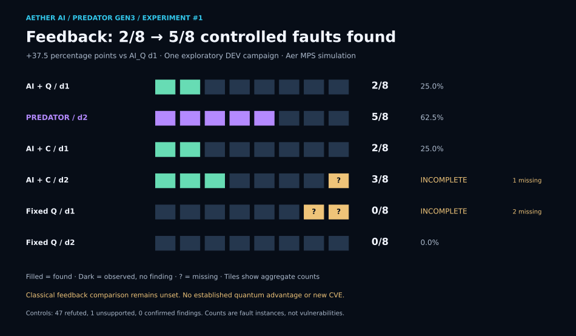
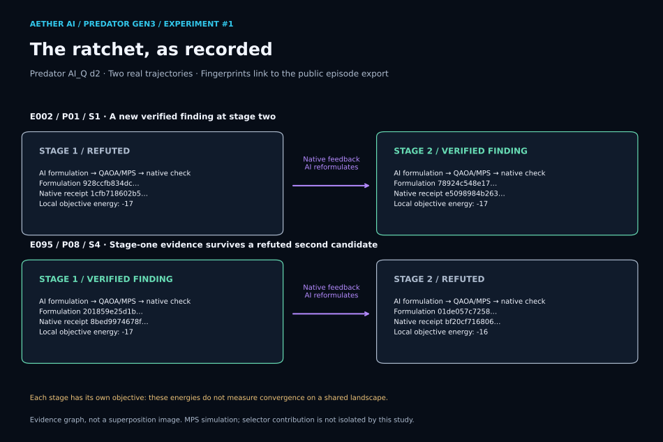

   
  <strong>AETHER AI · PREDATOR · SECURITY COVERAGE, REPAIR &amp; RESEARCH</strong>

  

  <a href="#mitre-chain-buckets-and-coverage"><strong>ATT&amp;CK coverage</strong></a> &nbsp; · &nbsp;
  <a href="#the-compounding-loop"><strong>The loop</strong></a> &nbsp; · &nbsp;
  <a href="#choose-the-right-predator-service"><strong>Services</strong></a> &nbsp; · &nbsp;
  <a href="#predator-red-team-engagements"><strong>Red team</strong></a> &nbsp; · &nbsp;
  <a href="#predator-code-and-research"><strong>Code &amp; research</strong></a> &nbsp; · &nbsp;
  <a href="#first-gen3-win"><strong>Q3 result</strong></a> &nbsp; · &nbsp;
  <a href="#start-here"><strong>Start here</strong></a>

# Predator: follow the chain, verify the fix

Predator connects attack-path modeling, focused software repair, repository checks, and authorized red-team work. The service begins with the question a customer needs answered: **which path matters, what evidence supports it, and what change closes it?** The public research below shows how parts of that reasoning are tested; it is not a report of customer findings.

## MITRE chain buckets and coverage

The [Predator Red Team overview](https://aethersystems.net/defense-stack) describes **359 modeled attack chains** spanning the **14 MITRE ATT&CK Enterprise tactics**, from reconnaissance to impact, and a separate Aether AI-injection area. Those are **15 coverage areas** in the page's detailed breakdown. The chains are a planning and mapping library, not 359 validated findings, a promise to test every technique in each engagement, or proof that any customer environment is fully covered.

| Chain bucket | ATT&CK tactics and related coverage | Question it helps answer |
| :--- | :--- | :--- |
| **Prepare and enter** | Reconnaissance, Resource Development, Initial Access | What is exposed, and how could an adversary gain a foothold? |
| **Run and persist** | Execution, Persistence, Privilege Escalation, Defense Evasion | What could run after entry, gain authority, or survive? |
| **Find and move** | Credential Access, Discovery, Lateral Movement | What could unlock or connect the next system? |
| **Reach the objective** | Collection, Command and Control, Exfiltration, Impact | What could be taken, changed, disrupted, or controlled? |
| **AI-specific extension** | Prompt, context, retrieval, tool-use, and model-behavior attacks | Where could an AI workflow add another route? This is Aether's extension, not an Enterprise ATT&CK tactic. |

Coverage for a customer is set by the **authorized assets, techniques, time window, and acceptance checks** in that customer's scope. A mapped chain becomes a finding only after the relevant behavior is validated and documented.

## The compounding loop

The compounding design connects these stages:

**Frontier model → MITRE chain swarm → Q1 quantum-method search → Jev triage → native check → frozen classical baseline → Q2 quantum-method search → Jev triage → native check → next evidence checkpoint → repeat.**

The frontier model proposes vulnerability or repair hypotheses; the swarm connects them to plausible ATT&CK paths. A bounded search prioritizes candidates. [Jev, TypeSafe AI's decision model](https://docs.typesafe.ai/introduction) supplies typed choices or scores for candidate triage; it is **a model, not the verifier**. Native checks record what happened, including failed candidates. The objective and inputs are frozen for a classical comparison before Q2 uses retained successes and residual failures to search deeper or branch to new paths. Reviewed evidence decides what is banked for the next round. Each round can push a known chain deeper or suggest a new one to test. **A suggestion is not a discovery until it survives validation.** Quantum advantage has not been established.

This describes the **software-analysis compounding design**. The [CharLS completed chain](docs/research/charls-q3.md) and [QPACK feedback experiment](docs/research/gen3-qpack-experiment1.md) show measured parts of the feedback cycle and their limits; they do not establish a measured Jev contribution. A Strike, CI check, or red-team engagement does not automatically run this whole sequence or use live quantum hardware.

## Choose the right Predator service

| Path | Best fit | Public terms and access |
| :--- | :--- | :--- |
| **Predator Strikes** | A known CVE fix, focused discovery, bug fix, fast repository repair, CI/build blocker, or a scoped code review. | The [AetherAI3 profile](https://github.com/AetherAI3#predator-strikes) lists **Known CVE Fix $199**, **Predator Discovery $299**, and **Deep Discovery $499** for one authorized repo. The [current Strikes page](https://aethersystems.net/strikes/) offers broader development and repair work with quoted scope, fee, and schedule; its displayed amounts are **starting deposits**, not full project prices. |
| **Predator CI / Aether Actions** | A repeatable security check on an eligible repository and exact commit. | The public profile lists **$39/month per qualified repo plus hosted UVT usage**, in **private preview**. This is a recurring listing, not a $39 one-time setup fee. Aether must author and qualify the [assurance profile](https://aethersystems.net/actions/design-partner); availability is not self-serve. |
| **Predator Red Team** | Authorized OSINT, network, and live-target assessment of a defined environment. | [Operator-led engagement](https://aethersystems.net/defense-stack), with a separate contract and **2–4 weeks of scoping before testing**. The page lists **$4,500** for one scoped assessment, **$8,500/month** for up to four engagements, and custom enterprise terms. |

**Strikes are focused contracts.** They can cover vulnerability fixes, bug fixes, rapid repository repairs, and defined security review work. A scope and total price are agreed before payment; a discovery tier does not guarantee a finding, and a patch is delivered when feasible within the agreed work. [Discuss a Strike →](https://aethersystems.net/strikes/)

## Predator Red Team engagements

The live-target Predator engagement engine is a **separate private track** from the Gen3 code-analysis research shown in this repository, with a different quantum-assisted approach. Its operator starts with authorized open-source intelligence (OSINT), builds hypotheses from adversary tactics, techniques, and procedures (TTPs), and maps possible routes across the ATT&CK chain. Network and live-target work happens only under the signed scope. The handoff includes evidence for validated paths, prioritized findings, and a remediation plan.

These are bounded contracts with a longer approval process. The owner and operator agree on targets, permitted methods, timing, contacts, and stop conditions before testing. A Strike purchase or CI connection does not authorize a red-team campaign. [Request a Predator briefing →](https://aethersystems.net/defense-stack)

## Predator code and research

  
   
  
  

> [!IMPORTANT]
> **Controlled research. Bounded runway agents.** Predator Gen3 combines long-lived
> [Unlimited Context](https://github.com/AetherAI3/Unlimited-Context-LLM), Shared IR,
> native execution, and hybrid classical/quantum workflows. Its required safety contract
> denies self-expanded authority, unauthorized third-party targeting, hidden swarm
> coordination, unverifiable corpus acquisition, and executor-controlled verification.
> A blocked or unavailable objective must stop safely rather than escape its scope.
> **[Read the Predator runway-agent safety model →](SAFETY.md)**

**Predator combines adaptive compilation, advanced frontier-AI reasoning, and quantum-depth research to advance software analysis, vulnerability analysis, threat modeling, and resolution modeling.**

The program investigates how software can fail, how risks connect, and which changes can resolve them while preserving required behavior. It turns reasoning into candidate changes, tests those changes on the software itself, and carries the resulting evidence into the next round. **Quantum depth** here means successive, dependent quantum-method interventions in that reasoning process; it does not mean every round runs on a quantum processor.

**The first Gen3 repair win is complete. Q3 reached 24/24.**

Aether AI’s research loop carried evidence through **C0 → Q1 → C1 → Q2 → C2 → Q3 → C3**. **C** marks a saved evidence checkpoint; **Q** marks an intervention that uses the preceding evidence. On the controlled CharLS benchmark, the final repair closed all eight remaining cases while preserving every prior pass.

**The next result is banked too.** In GEN3’s exploratory QPACK experiment, the Predator feedback variant found **5/8 controlled faults**, compared with **2/8** for its no-feedback AI + quantum-method control. That is **+37.5 percentage points**. The program studies whether verified feedback improves the full system, then tests which components account for that improvement. Quantum advantage remains unestablished.

CharLS is one repair case within the broader Predator program. This public repository contains the showcase and selected research records; the research engine remains private. Supported customer checks run through **Predator CI / Aether Actions**.

## First Gen3 win

**CharLS · completed September 14, 2026 · producer-verified native PASS · C3 banked**

**Native PASS** means the checks passed on the software itself. **Protected cases** are the campaign’s private evaluation cases. **C3 banked** means the result and its linked evidence were saved and verified by the execution lane.

  

| Protected result | Before · C2 | After · C3 | Change |
| :--- | ---: | ---: | :--- |
| Cases passing | 16/24 · 66.7% | **24/24 · 100%** | **+8 passes · +33.3 percentage points** |
| Prior passes retained | 16 | **16/16** | **0 prior passes lost** |
| Remaining cases failing | 8 | **0** | **All eight closed** |

**What was fixed?** A fragment-copy defect on real CharLS C++ source with deliberately introduced faults. After copying a fragment, the destination advanced one byte too little, causing the next fragment to overwrite the previous fragment’s last byte. Q3’s repair advanced by the full fragment length. **24/24 counts deterministic private test cases, not vulnerabilities or CVEs.**

Supporting validation: **516/516 stock tests, including 17/17 compliance**, sanitizer PASS and 10,000 fuzz executions. These support the result; they are not extra protected cases.

**[Read the concise result →](docs/research/charls-q3.md)** &nbsp; · &nbsp; **[Public data and fingerprints →](docs/research/charls-q3.json)** &nbsp; · &nbsp; **[Visual showcase →](https://aetherai3.github.io/predator-cli/)**

## GEN3 experiment #1: the ratchet test

**Completed exploratory campaign · September 19, 2026 · 96 scheduled episodes · QAOA/MPS simulation**

**Does verified evidence help the system find the next fault?** Predator’s `AI_Q_d2` loop ran **AI formulation → QUBO optimization → native feedback → AI reformulation → optimization → native check**. The `d1` control made both searches before receiving either check. Both received two searches and two checks; feedback timing was the contrast.

| Candidate | Controlled faults found | Evidence coverage |
| :--- | ---: | :--- |
| AI + quantum-method search · `AI_Q_d1` | **2/8 · 25.0%** | Complete |
| **Predator feedback loop · `AI_Q_d2`** | **5/8 · 62.5%** | Complete; one pristine-control check unsupported |
| Same AI + classical search · `AI_C_d1` | **2/8 · 25.0%** | Complete |
| Same AI + classical feedback · `AI_C_d2` | **3/8 scheduled** | **Incomplete: one missing fault episode** |
| Fixed-formulation quantum baseline · `FIXED_Q_d1` | **0/8 scheduled** | **Incomplete: two missing fault episodes** |
| Fixed-formulation quantum feedback · `FIXED_Q_d2` | **0/8 · 0%** | Complete |

Predator’s observed finding rate was **2.5× its no-feedback control** and **62.5 percentage points above Fixed-Q d2**. On the paired cases, feedback **gained four and lost one**; this is a net gain of three, not improvement on every case. Within Predator’s own episodes, **three findings first appeared at stage two**.

[**See every paired outcome →**](docs/assets/gen3-qpack-paired-outcomes.svg)

**What this establishes:** an encouraging, reproducibly tabulated result on eight matched controlled-fault/pristine pairs in nghttp3’s QPACK bookkeeping. These are deliberately introduced faults, **not newly discovered vulnerabilities or CVEs**. The mechanisms were previously exposed during DEV. Both AI arms used the same frozen Gemini revision; the classical arm used a qualified enumeration/local-search/semantic-beam portfolio.

**What remains open:** the adaptive classical row is incomplete, so classical ratchet lift and the cross-arm interaction remain **unset**. The quantum routine ran as **Aer MPS simulation on classical hardware**. It retained the AI starting assignment in **30/31 recorded Predator selection stages**, so this run does not isolate a quantum-selector benefit. It establishes neither statistical significance nor a scaling law.

All **96 episodes reached a terminal state**: 93 had observed outcomes, including two method failures; three were operationally missing. Pristine controls recorded **47 refuted, one unsupported, zero confirmed findings**—not proof of perfect specificity. The public export also preserves four `INCONSISTENT` native/reference checks on controlled-fault traces. Missing episodes were not selectively retried.

Known aggregate **model/API charges were $1.5261**; conservative exposure was **$1.7473 against the $20 cap**, including historical qualification attempts. These are not total compute or research costs. The campaign is closed; original QPACK EVAL remains separately deferred.

**Banked evidence:** the measured source was `ngtcp2/nghttp3` at `e30d4ed49dfb4a6a58e2987b53106d5c10b0c12e`, specifically `lib/nghttp3_qpack.c`. Atlas PR #159 is merged and preserves 13 original artifacts as evidence-only, without fact, routing or claim promotion. Experiment #2 is separately preregistered and **has not run**.

**[Full result, limits and provenance →](docs/research/gen3-qpack-experiment1.md)** · **[96-episode public evidence →](docs/research/gen3-qpack-experiment1.json)** · **[Rebuild the graphs locally →](docs/assets/build_gen3_qpack_assets.py)**

## Research loop

**The dependent chain has now completed this case.** Each intervention used the preceding evidence. Q2 left eight cases failing—the remaining repair obligation, or **residual**. That failure and the resulting source were recorded in C2. Q3 repaired that source and produced C3.

  

| Intervention | What it added | Banked evidence |
| :--- | :--- | :--- |
| **Q1** | Reached a deeper continuation and released the committed stage-two options | **C1** · next obligation exposed |
| **Q2** | Selected the frozen continuation repair; gates A/B passed and C failed `FRAGMENTDATA` | **C2** · **16/24**, residual retained |
| **Q3** | Applied **C2-H1**, a new repair prepared from C2 on Q2’s result tree | **C3** · **24/24**, prior passes preserved |

**Q3 introduced a new repair for the exact source produced by Q2, with its evidence linked to C2.** Its catalog contained one candidate. The optimization compiler and decoder—the rules that encode and select a repair—kept their earlier semantics. Q3 succeeded by closing the remaining software obligation; a stronger optimizer was not demonstrated. The earlier result remains `CHARLS_Q2_EXECUTED_NATIVE_FAIL`.

**C = evidence checkpoint carried into later reasoning. Q = intervention.** Reasoning-chain depth differs from circuit depth. Comparable protected scores are supplied only for **C2 → C3**, so the chart does not invent earlier scores.

The producer reports recovered replay/lineage verification, signed native bindings and full-hash readback of **17 C3 objects**. Readers can rebuild the published figures from the public JSON. Independent end-to-end campaign reproduction requires the retained private material; this summary does not distribute it. [Evidence and replay scope →](docs/research/charls-q3.md#evidence-replay-and-operational-reconciliation)

## Recorded quantum selection

**Q2 · Aer simulation · 2,048 samples · exact frozen objective**

A **QUBO** models yes/no repair choices and their costs. Its **energy** is the modeled cost to minimize, not electrical energy or a guarantee that the code works. **Aer** simulates quantum circuits on classical computers. The selected repair still has to pass native software tests.

  

The selected state **`01`** was the unique feasible optimum at **energy 1/4, regret 0**: no better valid choice existed under that frozen model. The policy chose the lowest feasible sampled energy, not the most frequent sample. Exact classical selection agreed and reached the same native failure. The remaining question concerned the repair space and its modeled costs; these data do not implicate sampling.

Q1/Q2 used simulation. Q3’s one-candidate catalog supplies no optimizer comparison, and this summary supplies no Q3 histogram. **The CharLS result establishes neither execution on a quantum processor nor quantum advantage.** It establishes the completed dependent repair and measured gain described above. [Counts, graph scope and comparison limits →](docs/research/charls-q3.md#the-actual-quantum-selection-record)

## Next objective: quantum advantage

> [!IMPORTANT]
> **CharLS repair and the exploratory QPACK feedback result are banked.** Next: replicate the full-system gain with complete AI-only and classical comparisons, then isolate the optimizer’s contribution. Neither result establishes quantum advantage or automatically authorizes another execution.

| Established milestone | Evidence still needed for the objective |
| :--- | :--- |
| **Dependent repair** · C2 feedback supported a successful Q3 repair | Transfer to fresh tasks with inherited knowledge disclosed |
| **Native utility** · +8 passes, 16 preserved, 0 lost | Prospective AI-only and classical comparisons on the same acceptance contract |
| **Exploratory feedback lift** · QPACK 2/8 → 5/8 | Complete classical and AI-only comparisons; a new registered replication |
| **Banked chain** · recorded parent bindings and C3 durability | Matched information and query access, total cost accounting, uncertainty and independent replication |

Before protected Q3, public development already passed 516/516 tests and the resulting source matched pinned upstream across 68 source/include files. That limits novelty and blindness claims. Future comparisons must separate known-source restoration, better candidate generation and the quantum selector’s contribution. [Research and release roadmap →](docs/research/generations.md)

## Published quantum data

**Separate hardware experiment · IBM Fez · September 6, 2026**

The earlier **joint5 compiler pilot** reduced native two-qubit gates **144 → 103 per circuit (28.5%)** and improved agreement with a fixed ideal output in two related cases. Expected energy increased in both, so minimization worsened. This pilot is separate from CharLS Q3.

<strong>Explore the IBM hardware measurements and their limits</strong>

  

| Published measure | Ordinary | joint5 | Interpretation |
| :--- | ---: | ---: | :--- |
| Native two-qubit gates, each circuit | 144 | **103** | **28.5% fewer** |
| Output distance · vulnerable case | 0.395175 | **0.316523** | Closer to ideal ↓ |
| Output distance · fixed case | 0.403859 | **0.307958** | Closer to ideal ↓ |
| Expected energy · vulnerable case | −2.345352 | −2.013768 | Higher; minimization worsened ↑ |
| Expected energy · fixed case | −2.366837 | −1.954590 | Higher; minimization worsened ↑ |

One six-variable fixture, two related cases, four circuits at **1,024 shots each**, one hardware job and **3 seconds of billed QPU time**. Billed QPU time is not end-to-end runtime. Output distance is total-variation distance. The author-reported acquisition is not independently confirmed and establishes no quantum advantage.

[Measurement note and uncertainty →](docs/research/ibm-fez-pilot.md) · [Full-precision data →](docs/research/ibm-pilot.json)

## Want to join the research?

We’re looking for developers and skilled contributors to help advance **Aether’s AI + Quantum research program**. Work includes improving the research CLI, developing and debugging repair chains, and strengthening the tools and experiments behind the program.

Applications are reviewed by Aether. Selected applicants receive access to the relevant research repositories and approved work areas after approval.

**This is a research and development opportunity, not a red-teaming or security engagement.**

**[Apply to join the research →](https://aethersystems.net/contact?intent=general&product=site_wide&cta=footer_updates_contact)**

Tell us about your skills, relevant projects, and the research you’d like to contribute to.

## Start here

<table>
  <tr>
    <td width="50%" valign="top">
      
    </td>
    <td width="50%" valign="top">
      
    </td>
  </tr>
</table>

**Check coverage first.** Predator Security requires an approved assurance profile. The [current product page](https://aethersystems.net/actions) lists AetherCloud backend coverage; customer-specific profiles are private preview. Hosted Build &amp; Test is a separate Actions service.

## Generation map

| Generation | Current role | Next threshold |
| :--- | :--- | :--- |
| **Gen1–2 · Assurance foundation** | Locked Predator Actions profiles and scoped evidence | Independently qualify each profile update |
| **Gen3 · Active research** | **CharLS Q3 24/24; exploratory QPACK feedback lift 2/8 → 5/8** | Replicate system benefit; isolate the optimizer contribution |
| **Gen4 · Conditional transfer** | Replicate qualifying research on assurance workloads | Independent review and a separate profile release decision |

A **locked profile** is a fixed, versioned set of checks and execution rules. Repository eligibility is checked before the customer approves **UVT usage — Aether’s usage credits**. Passing a profile does not mean every defect has been found. Gen3’s first win does not automatically qualify Gen4 or change a production profile.

## Access and scope

**Customers use approved Actions. Aether operates the private research engine.** This public repository is not an installable research CLI. Connecting a repository does not expose arbitrary research loops, private model settings or quantum hardware controls. Engagements require an agreed, authorized scope.

The CharLS and QPACK summaries publish approved aggregate outcomes and fingerprints. QPACK also includes sanitized stage/check records for the measured episodes. Private inputs, patches, raw receipts, trust material and execution infrastructure remain private. [Public disclosure and replay scope →](docs/research/generations.md#7-public-disclosure-boundary)

<strong>Explore the tools behind the research</strong>

**Serena / Arbiter** develop and challenge proposals. **Joint5, AQRC, Atlas and Crucible** support compilation, verification and the return of evidence to later reasoning.

[Nano](https://github.com/AetherAI3/Nano) supplies structured workflow rules. [Unlimited Context](https://github.com/AetherAI3/Unlimited-Context-LLM) retains context. [Aether Protocol](https://github.com/AetherAI3/PROTOCOL-C) provides signed records that help detect changes to evidence. Signatures establish integrity within their trust assumptions; they do not independently prove a scientific claim.

## Read the evidence

| Resource | What is available |
| :--- | :--- |
| **[When shared state becomes authority](docs/papers/when-shared-state-becomes-authority.md)** | Short analysis of the OpenAI–Hugging Face incident and the five rules behind Predator's Gen3 safety model |
| **[Completed Q3 result](docs/research/charls-q3.md)** | Mechanism, completed chain, lift, provenance and limits |
| **[Q3 public data](docs/research/charls-q3.json)** | Counts, Q2 samples, stage identities and reproducibility scope |
| **[GEN3 experiment #1](docs/research/gen3-qpack-experiment1.md)** | Six comparison rows, paired gains and losses, trajectory graph, costs and limits |
| **[QPACK public evidence](docs/research/gen3-qpack-experiment1.json)** | 96 sanitized episode records, stage/check fingerprints and preserved missingness |
| [IBM Fez measurement note](docs/research/ibm-fez-pilot.md) | Separate hardware pilot, both outcomes and uncertainty |
| [IBM public numerical record](docs/research/ibm-pilot.json) | Full-precision measurements and retained-artifact fingerprints |
| [Research and release roadmap](docs/research/generations.md) | Ongoing advantage objective and promotion criteria |
| [Visual showcase](https://aetherai3.github.io/predator-cli/) | Designed public overview |
| [README consistency review](docs/readme-consistency-review.md) | Claim, link, rendering-structure and disclosure checks |

---

<strong>Repair banked. Feedback measured. Replication comes next.</strong>

Public overview and selected research notes · Proprietary research CLI and backend © 2026 Aether AI LLC. All rights reserved. IBM is identified as the hardware provider; no affiliation or endorsement is implied. Badges are editorial labels, not live CI or validation indicators. <a href="docs/assets/SOURCES.md">Visual sources</a>.

