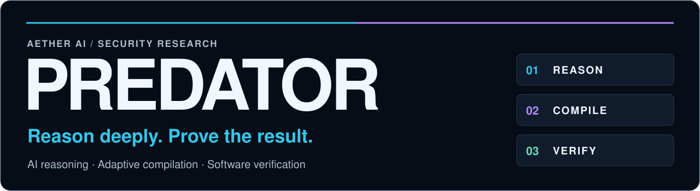
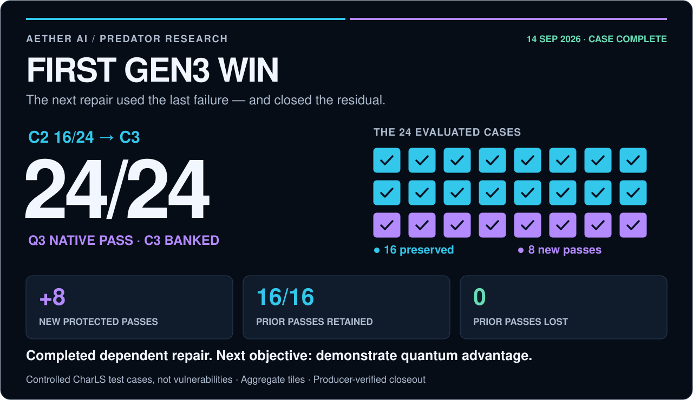
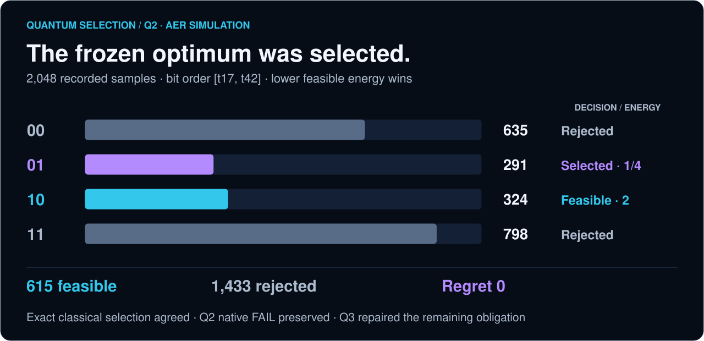
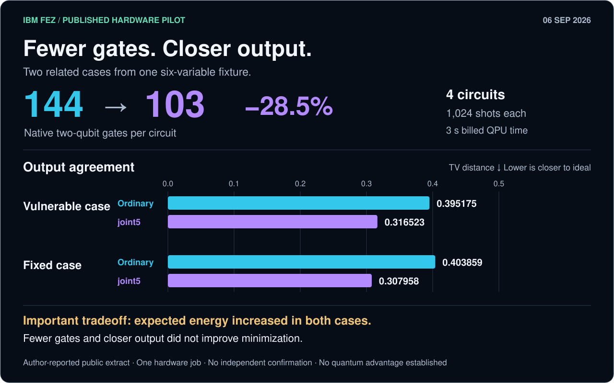
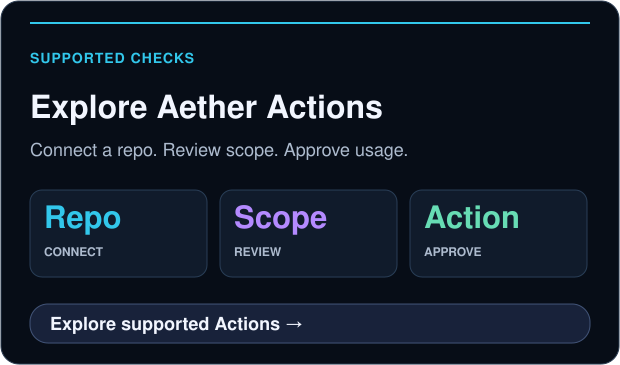
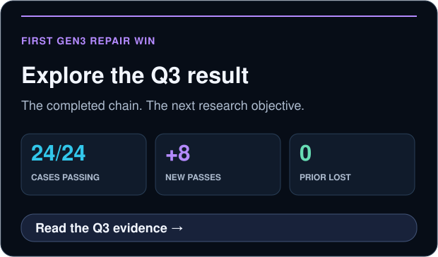

   
  <strong>AETHER AI · PREDATOR · SOFTWARE ANALYSIS &amp; SECURITY RESEARCH</strong>

  

  
   
  
  

  <a href="#predator-program"><strong>The program</strong></a> &nbsp; · &nbsp;
  <a href="#first-gen3-win"><strong>Q3 result</strong></a> &nbsp; · &nbsp;
  <a href="#research-loop"><strong>Completed chain</strong></a> &nbsp; · &nbsp;
  <a href="#recorded-quantum-selection"><strong>Quantum data</strong></a> &nbsp; · &nbsp;
  <a href="#next-objective-quantum-advantage"><strong>What follows</strong></a> &nbsp; · &nbsp;
  <a href="#start-here"><strong>Use Predator</strong></a>

**Predator combines adaptive compilation, advanced frontier-AI reasoning, and quantum-depth research to advance software analysis, vulnerability analysis, threat modeling, and resolution modeling.**

The program investigates how software can fail, how risks connect, and which changes can resolve them while preserving required behavior. It turns reasoning into candidate changes, tests those changes on the software itself, and carries the resulting evidence into the next round. **Quantum depth** here means successive, dependent quantum-method interventions in that reasoning process; it does not mean every round runs on a quantum processor.

**The first Gen3 repair win is complete. Q3 reached 24/24.**

Aether AI’s research loop carried evidence through **C0 → Q1 → C1 → Q2 → C2 → Q3 → C3**. **C** marks a saved evidence checkpoint; **Q** marks an intervention that uses the preceding evidence. On the controlled CharLS benchmark, the final repair closed all eight remaining cases while preserving every prior pass. **Gen3 continues toward its objective: proving quantum advantage under credible, matched comparisons.**

CharLS is one repair case within the broader Predator program. This public repository contains the showcase and selected research records; the research engine remains private. Supported customer checks run through **Predator CI / Aether Actions**.

   
  Predator operator console · Illustrative session and counters; the measured Q3 result follows below.

## First Gen3 win

**CharLS · completed September 14, 2026 · producer-verified native PASS · C3 banked**

**Native PASS** means the checks passed on the software itself. **Protected cases** are the campaign’s private evaluation cases. **C3 banked** means the result and its linked evidence were saved and verified by the execution lane.

  

| Protected result | Before · C2 | After · C3 | Change |
| :--- | ---: | ---: | :--- |
| Cases passing | 16/24 · 66.7% | **24/24 · 100%** | **+8 passes · +33.3 percentage points** |
| Prior passes retained | 16 | **16/16** | **0 prior passes lost** |
| Remaining cases failing | 8 | **0** | **All eight closed** |

**What was fixed?** A fragment-copy defect on real CharLS C++ source with deliberately introduced faults. After copying a fragment, the destination advanced one byte too little, causing the next fragment to overwrite the previous fragment’s last byte. Q3’s repair advanced by the full fragment length. **24/24 counts deterministic private test cases, not vulnerabilities or CVEs.**

Supporting validation: **516/516 stock tests, including 17/17 compliance**, sanitizer PASS and 10,000 fuzz executions. These support the result; they are not extra protected cases.

**[Read the concise result →](docs/research/charls-q3.md)** &nbsp; · &nbsp; **[Public data and fingerprints →](docs/research/charls-q3.json)** &nbsp; · &nbsp; **[Visual showcase →](https://aetherai3.github.io/predator-cli/)**

## Research loop

**The dependent chain has now completed this case.** Each intervention used the preceding evidence. Q2 left eight cases failing—the remaining repair obligation, or **residual**. That failure and the resulting source were recorded in C2. Q3 repaired that source and produced C3.

  

| Intervention | What it added | Banked evidence |
| :--- | :--- | :--- |
| **Q1** | Reached a deeper continuation and released the committed stage-two options | **C1** · next obligation exposed |
| **Q2** | Selected the frozen continuation repair; gates A/B passed and C failed `FRAGMENTDATA` | **C2** · **16/24**, residual retained |
| **Q3** | Applied **C2-H1**, a new repair prepared from C2 on Q2’s result tree | **C3** · **24/24**, prior passes preserved |

**Q3 introduced a new repair for the exact source produced by Q2, with its evidence linked to C2.** Its catalog contained one candidate. The optimization compiler and decoder—the rules that encode and select a repair—kept their earlier semantics. Q3 succeeded by closing the remaining software obligation; a stronger optimizer was not demonstrated. The earlier result remains `CHARLS_Q2_EXECUTED_NATIVE_FAIL`.

**C = evidence checkpoint carried into later reasoning. Q = intervention.** Reasoning-chain depth differs from circuit depth. Comparable protected scores are supplied only for **C2 → C3**, so the chart does not invent earlier scores.

The producer reports recovered replay/lineage verification, signed native bindings and full-hash readback of **17 C3 objects**. Readers can rebuild the published figures from the public JSON. Independent end-to-end campaign reproduction requires the retained private material; this summary does not distribute it. [Evidence and replay scope →](docs/research/charls-q3.md#evidence-replay-and-operational-reconciliation)

## Recorded quantum selection

**Q2 · Aer simulation · 2,048 samples · exact frozen objective**

A **QUBO** models yes/no repair choices and their costs. Its **energy** is the modeled cost to minimize, not electrical energy or a guarantee that the code works. **Aer** simulates quantum circuits on classical computers. The selected repair still has to pass native software tests.

  

The selected state **`01`** was the unique feasible optimum at **energy 1/4, regret 0**: no better valid choice existed under that frozen model. The policy chose the lowest feasible sampled energy, not the most frequent sample. Exact classical selection agreed and reached the same native failure. The remaining question concerned the repair space and its modeled costs; these data do not implicate sampling.

Q1/Q2 used simulation. Q3’s one-candidate catalog supplies no optimizer comparison, and this summary supplies no Q3 histogram. **The CharLS result establishes neither execution on a quantum processor nor quantum advantage.** It establishes the completed dependent repair and measured gain described above. [Counts, graph scope and comparison limits →](docs/research/charls-q3.md#the-actual-quantum-selection-record)

## Next objective: quantum advantage

> [!IMPORTANT]
> **First Gen3 win achieved. Gen3 research continues.** The next question is whether quantum participation produces an attributable advantage over strong AI-only and classical alternatives. Completing this case does not complete the program or automatically start Q4.

| Established milestone | Evidence still needed for the objective |
| :--- | :--- |
| **Dependent repair** · C2 feedback supported a successful Q3 repair | Transfer to fresh tasks with inherited knowledge disclosed |
| **Native utility** · +8 passes, 16 preserved, 0 lost | Prospective AI-only and classical comparisons on the same acceptance contract |
| **Banked chain** · recorded parent bindings and C3 durability | Matched information and query access, total cost accounting, uncertainty and independent replication |

Before protected Q3, public development already passed 516/516 tests and the resulting source matched pinned upstream across 68 source/include files. That limits novelty and blindness claims. Future comparisons must separate known-source restoration, better candidate generation and the quantum selector’s contribution. [Research and release roadmap →](docs/research/generations.md)

## Published quantum data

**Separate hardware experiment · IBM Fez · September 6, 2026**

The earlier **joint5 compiler pilot** reduced native two-qubit gates **144 → 103 per circuit (28.5%)** and improved agreement with a fixed ideal output in two related cases. Expected energy increased in both, so minimization worsened. This pilot is separate from CharLS Q3.

<strong>Explore the IBM hardware measurements and their limits</strong>

  

| Published measure | Ordinary | joint5 | Interpretation |
| :--- | ---: | ---: | :--- |
| Native two-qubit gates, each circuit | 144 | **103** | **28.5% fewer** |
| Output distance · vulnerable case | 0.395175 | **0.316523** | Closer to ideal ↓ |
| Output distance · fixed case | 0.403859 | **0.307958** | Closer to ideal ↓ |
| Expected energy · vulnerable case | −2.345352 | −2.013768 | Higher; minimization worsened ↑ |
| Expected energy · fixed case | −2.366837 | −1.954590 | Higher; minimization worsened ↑ |

One six-variable fixture, two related cases, four circuits at **1,024 shots each**, one hardware job and **3 seconds of billed QPU time**. Billed QPU time is not end-to-end runtime. Output distance is total-variation distance. The author-reported acquisition is not independently confirmed and establishes no quantum advantage.

[Measurement note and uncertainty →](docs/research/ibm-fez-pilot.md) · [Full-precision data →](docs/research/ibm-pilot.json)

## Start here

<table>
  <tr>
    <td width="50%" valign="top">
      
    </td>
    <td width="50%" valign="top">
      
    </td>
  </tr>
</table>

**Check coverage first.** Predator Security requires an approved assurance profile. The [current product page](https://aethersystems.net/actions) lists AetherCloud backend coverage; customer-specific profiles are private preview. Hosted Build &amp; Test is a separate Actions service.

## Generation map

| Generation | Current role | Next threshold |
| :--- | :--- | :--- |
| **Gen1–2 · Assurance foundation** | Locked Predator Actions profiles and scoped evidence | Independently qualify each profile update |
| **Gen3 · Active research** | **First dependent-repair win: Q3 24/24** | Demonstrate quantum advantage with credible comparisons |
| **Gen4 · Conditional transfer** | Replicate qualifying research on assurance workloads | Independent review and a separate profile release decision |

A **locked profile** is a fixed, versioned set of checks and execution rules. Repository eligibility is checked before the customer approves **UVT usage — Aether’s usage credits**. Passing a profile does not mean every defect has been found. Gen3’s first win does not automatically qualify Gen4 or change a production profile.

## Access and scope

**Customers use approved Actions. Aether operates the private research engine.** This public repository is not an installable research CLI. Connecting a repository does not expose arbitrary research loops, private model settings or quantum hardware controls. Engagements require an agreed, authorized scope.

The CharLS summary publishes approved aggregate outcomes and fingerprints. Private inputs, patches, raw receipts, trust material and execution infrastructure remain private. [Public disclosure and replay scope →](docs/research/generations.md#7-public-disclosure-boundary)

<strong>Explore the tools behind the research</strong>

**Serena / Arbiter** develop and challenge proposals. **Joint5, AQRC, Atlas and Crucible** support compilation, verification and the return of evidence to later reasoning.

[Nano](https://github.com/AetherAI3/Nano) supplies structured workflow rules. [Unlimited Context](https://github.com/AetherAI3/Unlimited-Context-LLM) retains context. [Aether Protocol](https://github.com/AetherAI3/PROTOCOL-C) provides signed records that help detect changes to evidence. Signatures establish integrity within their trust assumptions; they do not independently prove a scientific claim.

## Read the evidence

| Resource | What is available |
| :--- | :--- |
| **[Completed Q3 result](docs/research/charls-q3.md)** | Mechanism, completed chain, lift, provenance and limits |
| **[Q3 public data](docs/research/charls-q3.json)** | Counts, Q2 samples, stage identities and reproducibility scope |
| [IBM Fez measurement note](docs/research/ibm-fez-pilot.md) | Separate hardware pilot, both outcomes and uncertainty |
| [IBM public numerical record](docs/research/ibm-pilot.json) | Full-precision measurements and retained-artifact fingerprints |
| [Research and release roadmap](docs/research/generations.md) | Ongoing advantage objective and promotion criteria |
| [Visual showcase](https://aetherai3.github.io/predator-cli/) | Designed public overview |
| [README consistency review](docs/readme-consistency-review.md) | Claim, link, rendering-structure and disclosure checks |

---

<strong>First Gen3 win banked. The pursuit of quantum advantage continues.</strong>

Public overview and selected research notes · Proprietary research CLI and backend © 2026 Aether AI LLC. All rights reserved. IBM is identified as the hardware provider; no affiliation or endorsement is implied. Badges are editorial labels, not live CI or validation indicators. <a href="docs/assets/SOURCES.md">Visual sources</a>.

