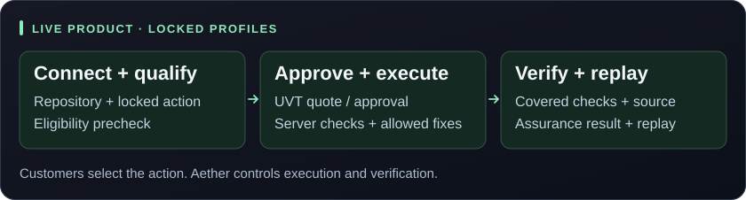
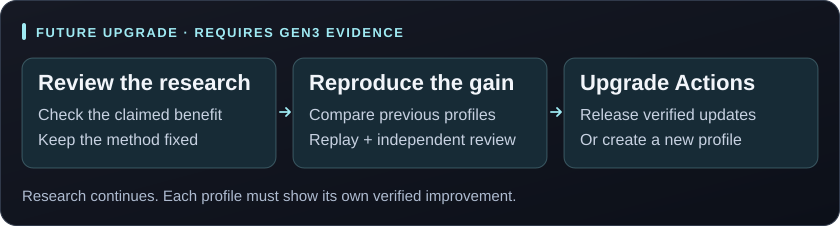
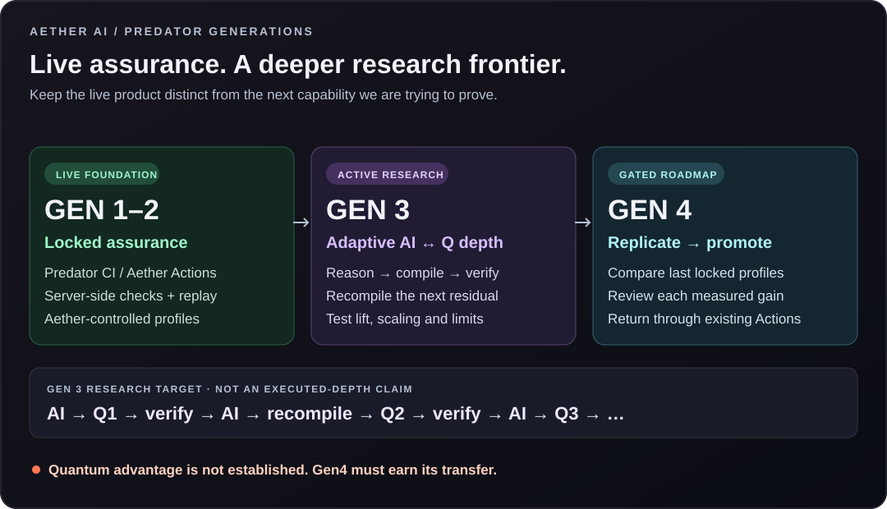

   
  <strong>AETHER AI · PREDATOR ASSURANCE &amp; RESEARCH</strong>

  

   
  Private operator console · Illustrative session, labels and counters—not research evidence.

  
   
  
  

**Live assurance. Deeper research. Evidence-led upgrades.** Predator brings Aether AI’s frontier reasoning, adaptive compilation and verification together: locked profiles through **Predator CI / Aether Actions** today, private AI–quantum depth research in Gen3, and gated profile replication in Gen4.

  
   
  <a href="https://aetherai3.github.io/predator-cli/">Predator showcase</a> · <a href="https://aethersystems.net/defense-stack#defense-stack">Defense stack</a> · <a href="https://aethersystems.net/contact?intent=general&amp;product=aether_predator_cli&amp;cta=research_readme">Discuss a scoped engagement</a>

> [!IMPORTANT]
> **Quantum advantage is a research objective—not an established result.** Gen3 research, the historical hardware pilot and the live assurance product remain distinct. Gen4 requires qualifying evidence and independent review.

## One program. Four generations.

### Gen1–2 · Live assurance

**Locked profiles. Aether-controlled execution. Results you can review.** Gen1–2 established the frontier-AI and quantum-assisted Crucible foundation behind the assurance profiles already delivered through Predator CI / Aether Actions.

  

Customers choose an approved action; Aether controls the profile, execution and remediation boundaries. The assurance stamp identifies the checks and source revision covered—not a guarantee that every defect has been eliminated.

### Gen3 · Push the reasoning frontier

**Adaptive compilation is the bridge we are investigating.** Frontier AI tackles the source; the compiler turns unresolved structure into a quantum intervention; native verification returns evidence to AI; the recompiler builds the next intervention from that updated state.

  

The question: **can deeper, causally connected AI–quantum chains produce more verified progress than strong, comparably resourced AI-only and classical alternatives?** We study sustained lift, diminishing returns and falloff—not an assumed exponential curve. More circuits or loops do not establish advantage.

Research spans **complex C++ systems, database/query workloads and stateful binary-processing code**. Benchmark identities, hidden corpora and campaign internals remain private.

### Gen4 · Replicate the gain. Upgrade the profiles.

**Prove it in research. Reproduce it in the product.** If Gen3 earns advantage-level evidence, Gen4 attempts to replicate that benefit against the last locked assurance profiles while deeper research continues in parallel.

  

Cloud, Agent, Atlas, CLI and open-source profile families are the intended targets. **Each profile earns its own promotion**—a benchmark result is not a blanket upgrade. A new assurance contract becomes a new locked profile, not a silent change to an existing one.

Public updates should pair old-versus-new results with source/profile versions, costs, limits and publication-safe replay. Customer code, private tests, credentials and research controls stay private. **No customer-facing quantum backend is introduced.**

**[Research guidance, evidence gates and rollout policy →](docs/research/generations.md)**

<strong>View the full generation map</strong>

  

## Operator-controlled by design

| Public product | Private research | Scoped engagements |
| :--- | :--- | :--- |
| Eligible repositories run locked Predator Actions on Aether servers, with UVT accounting and result/replay access. | Aether operators control the research CLI, models, compilers, loops and any separately authorized hardware work. | Contract-led analysis of authorized code and infrastructure, with explicit scope and reviewed findings. |

**Connecting a repository does not grant Predator CLI access, arbitrary loop execution, profile-internal controls, or QPU access.** Contract discussions do not imply self-service access to the private research engine.

<strong>🟣 Published hardware note · IBM Fez compiler-quality pilot</strong>

**September 6, 2026 · author-reported pilot.** AQRC’s **joint5** path used **28.5% fewer native two-qubit gates** than ordinary compilation on both tested poles.

| Native two-qubit gates | Acquisition | Billed QPU time |
| :---: | :---: | :---: |
| **144 → 103** | **4 circuits × 1,024 shots** | **3 seconds** |

| Total-variation distance ↓ | Ordinary | joint5 | Relative reduction |
| :--- | ---: | ---: | ---: |
| Vulnerable pole | 0.395175 | **0.316523** | **19.9%** |
| Fixed pole | 0.403859 | **0.307958** | **23.7%** |

**One fixture. Two poles. One hardware job.** Independent confirmation has not been performed. Expected energy increased, so improved minimization, deep-chain lift, and quantum computational advantage are not established. These historical measurements are not Gen3 trial results or Gen4 release evidence.

[Measurement note & uncertainty →](docs/research/ibm-fez-pilot.md) · [Full-precision public results →](docs/research/ibm-pilot.json)

<strong>🔴 The existing engine and defense stack</strong>

| Layer | Role in the program |
| :--- | :--- |
| **Frontier AI · Serena / Arbiter** | Reason about source, challenge proposals and identify unresolved work. |
| **Joint5 · AQRC · Atlas · Crucible** | Compile and recompile residual problems, reconstruct admissible evidence, and test the research hypotheses. |
|  **[Nano](https://github.com/AetherAI3/Nano)** | Structured language and deterministic policy within the existing engine. |
| **[Unlimited Context](https://github.com/AetherAI3/Unlimited-Context-LLM)** | Persistent state for long-running work. |
| **[Aether Protocol](https://github.com/AetherAI3/PROTOCOL-C)** | Signed records and tamper-evident commitments; signatures do not establish scientific validity on their own. |
| **Predator CI · Aether Actions** | The existing hosted, locked-profile delivery and replay surface. |

   
  Conceptual workflow animation—not a live run or evidence of quantum advantage.

The [defense-stack page](https://aethersystems.net/defense-stack#defense-stack) describes Aether’s broader operator-led security offering. Research, repository Actions and scoped infrastructure engagements retain separate permissions.

---

**Public overview, selected research notes and visual assets—not the proprietary CLI or backend.** This roadmap changes public positioning, not execution authority or production profiles.

© 2026 Aether AI LLC. All rights reserved. IBM is identified as a hardware provider; no affiliation or endorsement is implied. <a href="docs/assets/SOURCES.md">Visual sources</a>.
