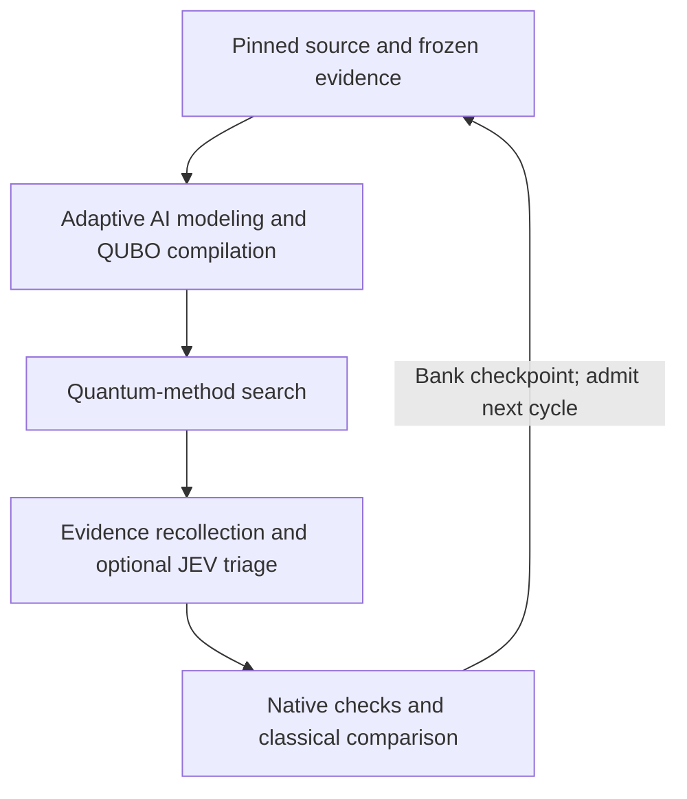

   
  <strong>AETHER AI · PREDATOR</strong>

  

  
  
  

# Predator

**Understand the path. Fix what matters. Show the evidence.**

Predator combines **frontier-AI reasoning, adaptive compilation, and hybrid classical/quantum research** to investigate software, model threat paths, and evaluate repairs. **Gen3 studies quantum depth:** successive research cycles that use the preceding cycle's evidence to reformulate the next problem.

Teams can commission a focused repository mission, qualify a repeatable security profile, or scope an authorized live assessment. The private Predator CLI brings Crucible research, chain and CVE cross-references, durable context, and browser/VM workflows into one operator workspace.

This public repository explains the program and shares selected research records. The operator engines are private; customer engagements and research access have separate approval paths.

> **[Read the Predator safety model →](SAFETY.md)**
>
> Human-approved scope and budgets bound each run. Recalled memory, model suggestions, and quantum results remain evidence; they cannot grant authority. The safety document distinguishes required policy from controls already proven in code.

[Services](#ways-to-work-with-aether) · [Crucible](#crucible-adaptive-modeling-and-quantum-depth) · [MITRE chains](#mitre-attck-chain-library) · [CVE catalog](#cve-research-catalog) · [Results](#what-the-public-research-found) · [Workspace and HTB](#the-operator-workspace) · [Evidence](#read-the-evidence)

## Ways to work with Aether

Choose a focused task, an ongoing repository profile, or a scoped live assessment.

<table>
  <tr>
    <td width="50%" valign="top"></td>
    <td width="50%" valign="top"></td>
  </tr>
</table>

| Path | When it fits | Start here |
| :--- | :--- | :--- |
| **Predator Strikes** | A known CVE fix, focused discovery, or chain analysis | [Discuss a Strike →](https://aethersystems.net/strikes/) |
| **Predator CI** | A repeatable security check for an eligible repository and exact commit; private preview | [Qualify a CI profile →](https://aethersystems.net/actions/design-partner) |
| **Predator Red Team** | An authorized assessment of a live environment | [Scope an assessment →](https://aethersystems.net/defense-stack) |

<strong>Published terms and engagement scope</strong>

| Path | Public terms |
| :--- | :--- |
| **Predator Strikes** | The [Strikes page](https://aethersystems.net/strikes/) lists **$199 Known CVE Fix**, **$299 Predator Discovery**, and **$499 Deep Discovery**, one-time for one authorized repo and agreed surface. |
| **Predator CI** | The [Strikes page](https://aethersystems.net/strikes/) lists **$39/month per qualified repo plus UVT for hosted runs**, in private preview. Aether works with each team to [qualify an assurance profile](https://aethersystems.net/actions/design-partner). |
| **Predator Red Team** | The [Red Team page](https://aethersystems.net/defense-stack) lists **$4,500** for one scoped assessment, **$8,500/month** for up to four, and custom enterprise terms. |

A Strike covers the repository and surface agreed before payment. Live testing has a separate engagement scope; broader engineering work goes through a [general project inquiry](https://aethersystems.net/contact). Legacy engineering deposit links on the Strikes page apply to previously quoted work, not these mission prices.

### Join the early Gen3 and Predator CI conversation

Work with Aether to identify one useful repository surface and the checks that matter to your team. A qualified profile explains what ran, what passed, and what remains outside the check.

[Talk with Aether about a Predator CI profile →](https://aethersystems.net/actions/design-partner)

### Live Predator Red Team

A live engagement is a separate, operator-led path. With the owner's permission, the team uses open-source intelligence (OSINT), network reconnaissance, and adversary tactics, techniques, and procedures (TTPs) to build and test plausible paths through the agreed environment. Findings are reviewed and handed over with evidence and remediation guidance.

Live testing needs a bounded contract and a longer approval process. The owner and operator agree on targets, permitted methods, timing, contacts, and stop conditions before work begins. The [published process](https://aethersystems.net/defense-stack) allows **2–4 weeks of scoping before testing**.

<strong>Red Team method and scoping timeline</strong>

  

The [Red Team page](https://aethersystems.net/defense-stack) describes IBM Quantum-assisted selection for scoped live engagements. That service has its own method and authorization. The [joint5 IBM Fez pilot](docs/research/ibm-fez-pilot.md) below is a separate compiler experiment, with its own measurements and limits.

## Crucible: adaptive modeling and quantum depth

  

**Crucible is Predator's software research and repair loop.** It starts from a pinned source revision, a defined question, and fixed acceptance checks. Frontier-AI reasoning develops candidate explanations or repairs; adaptive modeling expresses candidate choices and constraints as an optimization problem. Quantum-method search proposes selections, and evidence from checking them informs the next admitted cycle.

[Research roadmap →](docs/research/generations.md) · [Published results →](#what-the-public-research-found) · [joint5 hardware pilot →](#joint5-compiler-the-ibm-fez-hardware-result)

**Predator runs fanout through CodePro.** CodePro brings together **context retrieval** and the **System-2 shared intermediate representation (IR)**. Retrieval supplies relevant context to the workers; shared IR gives their source analysis a common structured representation for consolidation. The fanout feeds worker results back into the evidence-driven research loop, within the run's admitted scope and budget.

Implementation and evaluation material live in AETHER-CLOUD's [System-2 orchestration](https://github.com/AetherAI3/AETHER-CLOUD/tree/main/lib/orchestrator/system2), [native compiler](https://github.com/AetherAI3/AETHER-CLOUD/tree/main/native), and [benchmarks](https://github.com/AetherAI3/AETHER-CLOUD/tree/main/bench) (repository access required).

### What happens in one cycle

```mermaid
flowchart TD
    C["Pinned source and frozen evidence"] --> M["Adaptive AI modeling and QUBO compilation"]
    M --> Q["Quantum-method search"]
    Q --> R["Evidence recollection and optional JEV triage"]
    R --> V["Native checks and classical comparison"]
    V -->|"Bank checkpoint; admit next cycle"| C
```

| Stage | What it does |
| :--- | :--- |
| **Adaptive QUBO modeling** | Reformulates the unresolved question using the parent evidence. A **quadratic unconstrained binary optimization (QUBO)** model represents yes/no choices, their interactions, and penalties for violating modeled constraints. Its energy is the modeled cost to minimize. |
| **Quantum-method search** | Searches the compiled choices and records the selected candidate. A run identifies its solver and whether execution used circuit simulation or quantum hardware. Classical selection provides a comparison against the same frozen problem. |
| **Recollection and JEV** | Carries candidate outputs, sources, counterexamples, and unresolved questions back into reasoning. When configured, **[Jev](https://docs.typesafe.ai/introduction)** supplies structured triage or routing decisions. Its use is recorded per run; native checks establish behavior. |
| **Validation and checkpointing** | Checks the software itself, records passes and failures, compares against the fixed starting point, and preserves the evidence for a separately admitted continuation. Model confidence and low QUBO energy do not establish a working repair. |

### The compounding loop: quantum depth over ratchet cycles

**Each cycle inherits the preceding checkpoint's evidence and remaining obligations.** A failure can reveal an omitted constraint, refute a hypothesis, or expose the next repair obligation. The next formulation can therefore ask a more informed question rather than repeating the original search.

Published Gen3 checkpoints and interventions are labeled **C0 → Q1 → C1 → Q2 → C2 → Q3 → C3**:

- **C** is a saved evidence checkpoint: the source, results, and unresolved work carried forward.
- **Q** is a dependent quantum-method intervention built from that parent evidence.
- **Quantum depth** counts those dependent interventions in one evidenced chain. Circuit depth describes the quantum circuit within an intervention; these are separate measurements.

The **ratchet** preserves the verified incumbent and earlier evidence while evaluating a new candidate. A later candidate can fail, and that failure remains in the record. Compounding means accumulating checked information across cycles; useful gains are measured at each stage.

The [CharLS Q3 case](docs/research/charls-q3.md) makes this concrete: Q2 left a fragment-repair obligation open at **16/24 protected test passes**. Q3 used the C2 evidence to prepare a new repair and reached **24/24**, preserving all 16 earlier passes. That demonstrates a successful dependent repair; the selector's contribution needs its own comparison.

<strong>Execution, custody, and research status</strong>

Local classical/quantum research uses Qiskit Aer simulation with exact classical comparisons where documented. The public CharLS and QPACK studies used simulation. The joint5 pilot below supplies a separate hardware record.

Signed research-worker custody binds stages to source and artifacts; live signed acceptance and variable-depth custody remain under validation. Each new stage needs its own scope, budget, and admission. Unlimited Context and pinned checkpoints retain the research trail across bounded stages.

Gen3's continuing objective is to demonstrate an attributable quantum advantage against credible AI-only and classical alternatives, with matched information, resources, and independent replication. The public studies do not yet establish that advantage or a measured Jev contribution.

[Read the research roadmap and depth definitions →](docs/research/generations.md)

## MITRE ATT&CK chain library

**416 unique modeled attack chains · 18 research routing categories · October 3, 2026 registry snapshot**

The **Gen3 chain library** organizes possible paths through systems into connected research models. A chain links steps, prerequisites, and supporting references so an investigation can ask how one weakness might relate to another. It supplies structured hypotheses for review, source analysis, and scoped validation.

Fifteen categories align with the current **[MITRE ATT&CK Enterprise tactics](https://attack.mitre.org/tactics/enterprise/)**. Three additional Predator categories cover **AI attacks**, **[OWASP MCP Top 10](https://owasp.org/www-project-mcp-top-10/)** risks, and **memory-safety primitives**. These are 18 internal selector buckets, including 15 MITRE tactics.

| Coverage | What the library organizes |
| :--- | :--- |
| **Entry and preparation** | Reconnaissance, resource development, and initial access |
| **Execution and continued access** | Execution, persistence, privilege escalation, Stealth, and defense impairment |
| **Movement and objectives** | Credential access, discovery, lateral movement, collection, command and control, exfiltration, and impact |
| **AI and MCP workflows** | Prompt, retrieval, context, tool-use, and model-behavior risks, plus MCP-specific trust boundaries |
| **Memory safety** | CAPEC/CWE-aligned code primitives that can contribute to several different paths |

**Chains and CVEs are cross-referenceable in Research mode and Drive.** A chain's CVE anchors connect its modeled steps to the separate catalog's source records. Researchers can inspect the underlying advisory, affected versions, and prerequisites before deciding whether a connection applies to the pinned source or authorized environment.

Research mode develops source-cited hypotheses and can propose extending a chain or creating a new one. Proposals retain sources, counterexamples, unresolved prerequisites, and a review trail. Source review and appropriate native validation are required before an edge enters the canonical registry.

The registry count describes modeled coverage. The chains available to a particular CLI build or mission depend on its pinned registry and authorized scope; a modeled path becomes a finding only when behavior is supported by evidence.

<strong>Examples of publicly documented CVE anchors</strong>

The latest five models span initial access, persistence, execution, collection, and exfiltration, with step-scoped references to publicly documented [Cisco IOS XE](https://sec.cloudapps.cisco.com/security/center/content/CiscoSecurityAdvisory/cisco-sa-iosxe-webui-privesc-j22SaA4z), [PAN-OS](https://security.paloaltonetworks.com/CVE-2024-3400), and [MOVEit](https://content.govdelivery.com/accounts/USDHSCISA/bulletins/35ecb08) CVEs. These links ground research hypotheses; they do not establish a finding against an assessed asset.

## CVE research catalog

**A separate source-record database, linked to the chain library by CVE ID.**

The private **CVE research catalog** retains known-vulnerability records and enrichment so researchers can inspect the evidence behind a chain anchor. The chain library models relationships and possible paths; the catalog supplies vulnerability descriptions, affected-product information, advisory references, problem types, and scoring data.

Its implementation supports importing CVE JSON 5.x records from the **[official CVE List](https://github.com/CVEProject/cvelistV5)** while preserving the original source record. Separate **NVD, CISA KEV, and FIRST EPSS** enrichment adds context from completed refreshes. Catalog coverage and freshness follow the imports and snapshots actually available; no verified live database total is published here.

### Cross-reference in Research mode and Drive

| Workflow | How the two research sources fit |
| :--- | :--- |
| **Research mode** | Start from a chain or CVE, inspect the related source records, and develop cited hypotheses, counterexamples, or proposed chain extensions. |
| **Drive** | Use the admitted mission's pinned chain and catalog evidence to ground the investigation and retain what was actually reviewed in its evidence trail. Native execution depends on the mission's admission and validation gates. |

Deep-cycle integration retrieves shortlisted **full CVE cards before ranking** and records the reviewed material. Availability depends on access to the pinned catalog snapshot. Static chain anchors identify the CVE; current enrichment comes from the catalog's completed refreshes.

A CVE card provides research context. Assessing an asset still requires checking the relevant code or version, configuration, prerequisites, and observed behavior within scope.

## What the public research found

<table>
  <tr>
    <td width="50%" valign="top"></td>
    <td width="50%" valign="top"></td>
  </tr>
</table>

| Study | Published result | What it establishes |
| :--- | :--- | :--- |
| **[CharLS Q3 repair](docs/research/charls-q3.md)** | **16/24 → 24/24** protected test passes; eight gained, all earlier passes retained | A dependent repair closed the remaining obligation on real C++ source with deliberately introduced faults. |
| **[QPACK feedback study](docs/research/gen3-qpack-experiment1.md)** | **5/8** controlled faults found with intermediate feedback, versus **2/8** without it | Feedback helped in this small exploratory campaign. The adaptive classical comparison was incomplete, and the experiment did not isolate a quantum-selector benefit. |

These are controlled test cases and deliberately introduced faults. They do not establish new CVEs, quantum advantage, or a measured Jev contribution. **We have not published a fresh, previously undiscovered CVE finding.** Discovery and matched comparisons remain active research.

### joint5 compiler: the IBM Fez hardware result

The **AQRC joint5 compiler pilot** is a separate hardware experiment in Predator's research lineage. It tested ordinary and joint5 compilation of the same fixed circuits on **IBM Fez**: one six-variable fixture, two related poles, four circuits at 1,024 shots each, in one hardware job.

| Measurement | Ordinary → joint5 | Interpretation |
| :--- | :--- | :--- |
| **Native two-qubit gates, each pole** | **144 → 103** | **28.5% fewer gates** |
| **Distance from ideal output, vulnerable pole** | **0.3952 → 0.3165** | **19.9% lower** total-variation distance |
| **Distance from ideal output, fixed pole** | **0.4039 → 0.3080** | **23.7% lower** total-variation distance |

Total-variation distance measures output-distribution disagreement; lower means closer to the exact ideal distribution. **Expected energy worsened on both poles**, so the pilot supports a narrow compiler-quality result. It does not establish improved minimization or quantum advantage. This single acquisition has no independent confirmation and does not supply hardware evidence for the simulated CharLS or QPACK studies.

[Read the joint5 measurements and uncertainty →](docs/research/ibm-fez-pilot.md) · [Full-precision public data →](docs/research/ibm-pilot.json)

## The operator workspace

The private **Predator CLI** brings the research loop, tools, persistent evidence, and supported browser/guest workflows into one conversation. Choose an available Aether model, inspect its actions, and keep the investigation attached to its source, artifacts, and scope.

| Workflow | What the operator gets |
| :--- | :--- |
| **Research, Crucible, and Drive** | Chain/CVE cross-references, candidate selection, evidence review, and admitted validation stages. |
| **CodePro fanout** | Context retrieval and System-2 shared IR support parallel worker analysis and consolidation into the research evidence trail. |
| **Clean model worktrees** | An isolated Git worktree and stable run identity for each model, with pinned source, artifacts, and restart checks. |
| **Unlimited Context** | Reusable memory pools that recall relevant sources, notes, counterexamples, and unresolved questions across sessions. |
| **Predator RC and browser/VNC views** | A visible browser, encrypted remote browser-and-activity viewing, and human takeover and hand-back. |
| **HTB and VM training workflows** | Browser research, supported Pwnbox/noVNC guest interaction, and scoped work in an owned VM connected to the lab VPN. |

### Clean worktrees and Unlimited Context

**Each model run has its own Git worktree, source revision, artifacts, and attribution.** Switching models starts a distinct run while preserving earlier work. Restart checks verify the task, worktree, and memory-pool identity so a continued investigation stays attached to the correct branch and evidence.

**[Unlimited Context (UCL)](https://github.com/AetherAI3/Unlimited-Context-LLM)** is Aether's open-source context engine. A named memory pool can be reused across CLI sessions, with relevant source-backed notes retrieved into the active model's bounded context. Each model branch retains its own notes and evidence, allowing investigations to continue across model changes and session boundaries.

“Unlimited” describes **retrieval reach**: the model keeps its native attention window while the engine retrieves relevant slices from a larger stored pool. Research continuity still depends on successful recall and current evidence. Browser and guest control require a fresh session check after interruption.

[Explore UCL →](https://github.com/AetherAI3/Unlimited-Context-LLM) · [How the engine works →](https://github.com/AetherAI3/Unlimited-Context-LLM#how-it-works) · [UCL safety measures →](https://github.com/AetherAI3/Unlimited-Context-LLM/blob/main/SAFETY.md)

### Predator RC, browser views, and CTF work

**Predator can work through a browser and supported VNC/noVNC guest console, with the operator watching the same session.** RC connects the owned browser and CLI activity to a remote viewing surface through an encrypted relay; the local noVNC surface stays on the host. Human takeover lets the operator sign in or make a sensitive choice, then hand back the session with fresh page evidence.

This gives HTB a clear place in the product: **Hack The Box is a training environment for the browser/VM workflow.** CTF missions, Academy labs, and Sherlock-style forensic investigations involve different tasks, but all need visible actions, retained evidence, and an authorized environment. Supported Pwnbox consoles provide a guest surface; an owned VM connected to the appropriate lab VPN provides another route.

| Environment or task | Scope of the public evidence |
| :--- | :--- |
| **HTB Pwnbox / noVNC** | Validated attachment, observation, reviewed input, human takeover, resume, and cleanup. |
| **Owned Ubuntu VM + Academy VPN** | Completed the Nmap training module described below, with autonomous GLM-5.3 command execution and owner answer entry. |
| **Other CTFs, Sherlocks, VMs, or VPNs** | Further workflow uses; each provider, connection, and action surface needs its own scope and validation. The Nmap milestone does not certify every environment. |

RC is in a **controlled private preview**. The production viewer and relay have been exercised in an owner canary; the complete sign-in, mission selection, and controller hand-back journey remains under validation.

### Network enumeration with Nmap

**All 12 sections completed · HTB Academy · October 3, 2026**

This is one recorded training example of Predator operating an owned VM. **Predator, through GLM-5.3, ran the VM commands autonomously.** The owner supplied plain-language prompts such as “go” and the HTB exercise questions. GLM-5.3 planned the commands, interpreted outputs, and revised candidates after exercise feedback. **The owner typed the resulting answers into Academy.**

*Sanitized evidence replay assembled from saved scans, model responses, and owner-provided Academy screenshots.*

The retained record covers enumeration reports, service review, exercise feedback, the Easy/Medium/Hard labs, and owner-confirmed completion of all 12 sections. Target addresses, VPN material, and exercise flags are withheld. The replay is an assembled record rather than a continuous desktop recording.

[Read the completion record and model/owner roles →](docs/research/htb-academy-nmap.md) · [Browse all HTB tracks, certificate, and replays →](docs/htb/README.md)

<strong>Watch the earlier Pwnbox console preview</strong>

The earlier timed Pwnbox session demonstrated attachment, observation, reviewed input, human takeover, resume, and cleanup. This short preview shows the guest-terminal TTL lesson check. The later VPN-based module completion used the owner's Ubuntu VM.

## Developers: join the research program

We also welcome developers who want to help advance the research itself. Work can include the CLI, repair chains, verification tools, and careful classical/quantum comparisons. Tell us what you have built and which part of the program interests you.

Aether reviews applications and grants access to relevant private work areas only after approval. This is a development and research opportunity, separate from a customer red-team engagement.

[Apply to join the research →](https://aethersystems.net/contact?intent=general&product=site_wide&cta=footer_updates_contact)

## Read the evidence

- [HTB Academy Nmap completion](docs/research/htb-academy-nmap.md): all 12 sections, the sanitized replays, and the model/owner roles.
- [HTB showcase](docs/htb/README.md): Satellite Exploitation certificate and replays, AI/ML track progress, and Academy records.
- [CharLS Q3 result](docs/research/charls-q3.md) and [public data](docs/research/charls-q3.json): the completed dependent repair and its limits.
- [Gen3 QPACK study](docs/research/gen3-qpack-experiment1.md) and [episode data](docs/research/gen3-qpack-experiment1.json): feedback results, comparisons, and missingness.
- [joint5 IBM Fez compiler pilot](docs/research/ibm-fez-pilot.md) and [public data](docs/research/ibm-pilot.json): gate reduction, output agreement, and the expected-energy regression.
- [Research roadmap](docs/research/generations.md): what must be shown before research moves into a customer profile.
- [Predator safety model](SAFETY.md): the boundaries required for long-running research agents.
- [Unlimited Context](https://github.com/AetherAI3/Unlimited-Context-LLM): the open-source engine for context reach and session continuity.

Predator research runs only within an approved scope. A model suggestion, a mapped chain, and a passing repository profile are different kinds of evidence; none is a guarantee that every vulnerability has been found.

Public overview and selected research notes · Private operator engines © 2026 Aether AI LLC. All rights reserved. IBM is identified as a hardware provider; no affiliation or endorsement is implied. <a href="docs/assets/SOURCES.md">Visual sources</a>.

