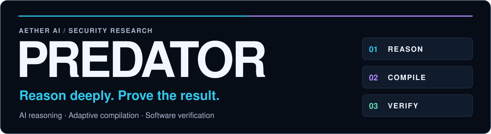
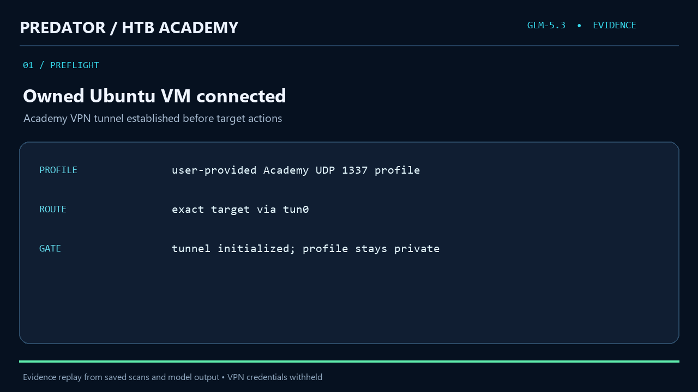
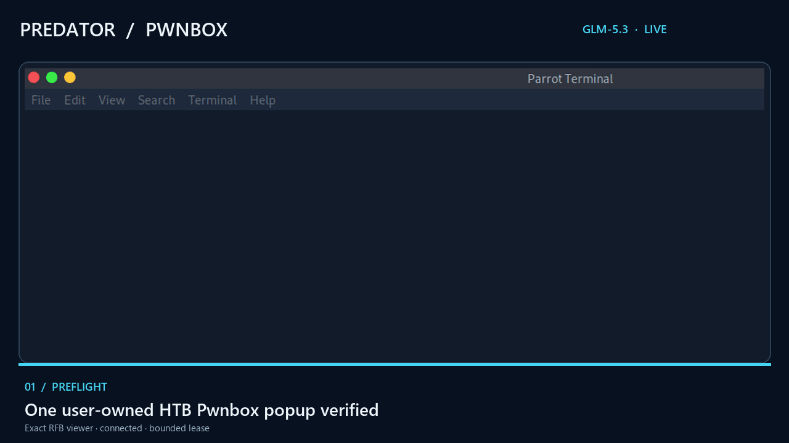
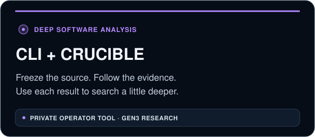
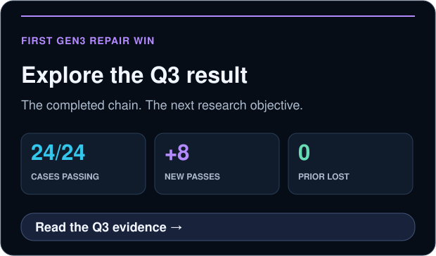
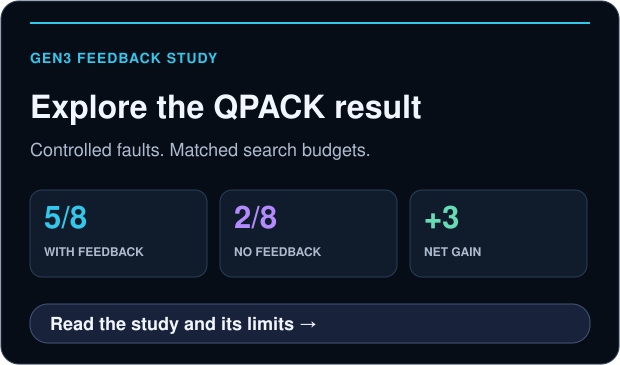
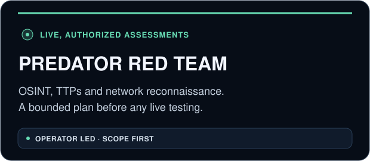
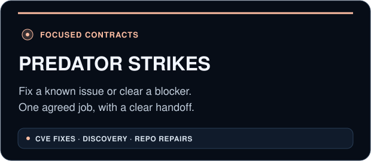
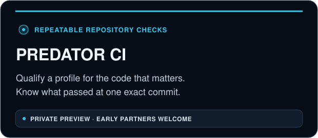

   
  <strong>AETHER AI · PREDATOR</strong>

  

  
  
  

# Predator

**Understand the path. Fix what matters. Show the evidence.**

Predator is Aether AI's family of security tools and services. Its private CLI brings research, scoped tools, visible browser work, and the selected Aether model into one operator workspace. Persistent worktrees and Unlimited Context keep source, notes, and evidence connected across sessions.

This public repository explains the work and shares selected research records. It does not contain the private engines or give access to run an engagement.

[Watch the Nmap demo](#network-enumeration-with-nmap) · [Operator workspace](#the-operator-workspace) · [Crucible research](#the-cli-crucible-and-the-research-loop) · [Services](#ways-to-work-with-aether) · [Evidence](#read-the-evidence)

## Network enumeration with Nmap

**All 12 sections completed · HTB Academy · October 3, 2026**

Predator ran the Nmap enumeration **autonomously through GLM-5.3** in an owned Ubuntu VM over the Academy VPN. The owner provided plain-language prompts such as “go” and supplied the HTB exercise questions. GLM-5.3 planned and executed the VM commands, reviewed the outputs, and revisited rejected candidates. The owner typed the resulting answers into Academy.

*Sanitized evidence replay assembled from saved scans, model responses, and owner-provided Academy screenshots.*

| Stage | What the record shows |
| :--- | :--- |
| **Enumeration and reporting** | Full TCP scan, saved reports, hostname evidence, and service/version review. |
| **NSE checks** | Script-output review and a fresh HTTP check after an earlier answer was rejected. |
| **Easy, Medium, and Hard labs** | Separate Academy targets, bounded steps, and reviewed results through the three IDS/IPS exercises. |
| **Module completion** | Owner-confirmed accepted answers and an Academy completion screenshot covering all 12 sections. |

The replay withholds target addresses, VPN material, and exercise flags. It shows the evidence from autonomous VM enumeration with GLM-5.3; Academy answer entry was performed by the owner. [Read the completion record and roles →](docs/research/htb-academy-nmap.md)

<strong>Watch the earlier Pwnbox console preview</strong>

The earlier timed Pwnbox session demonstrated attachment, observation, reviewed input, human takeover, resume, and cleanup. This short preview shows the guest-terminal TTL lesson check. The later VPN-based module completion used the owner's Ubuntu VM.

## The operator workspace

The private Predator CLI brings research, tools, browser work, and supported CTF guest consoles into one conversation. Choose an available Aether model, inspect its actions, and follow the evidence as the task progresses.

| Workflow | What the operator gets |
| :--- | :--- |
| **Predator RC and browser viewing** | A visible browser, an encrypted Aether RC browser-and-activity view, and human takeover and hand-back. |
| **Web missions and CTF training** | Source-cited web research and reviewed actions in a supported, user-owned noVNC guest console, including HTB Pwnbox. |
| **Model worktrees and sessions** | A separate Git worktree and stable identity for each model run, with pinned source, artifacts, and restart checks. |
| **Unlimited Context** | Named memory pools with bounded recall of relevant sources, notes, counterexamples, and unresolved questions. |
| **Research and Crucible** | Chain- and CVE-grounded investigation, candidate selection, evidence review, and proposals for deeper or new chain models. |

### Predator RC, browser views, and CTF work

Watch the selected model navigate, read, and interact with an owned browser. Predator RC connects that browser and CLI activity to a remote viewing surface through an encrypted relay; the local noVNC surface stays on the host. Human takeover lets the operator sign in or make a sensitive choice, then hand back the same session with fresh page evidence.

The CTF path supports an attached user-owned Pwnbox console with observed guest state and reviewed actions. Live validation demonstrated attachment, observation, reviewed input, takeover, resume, and cleanup. The [Nmap milestone](#network-enumeration-with-nmap) adds completed Academy training with autonomous GLM-5.3 command execution and human answer entry. Additional guest providers require their own validation.

RC is in a controlled private preview. The production viewer and relay have been exercised in an owner canary; the complete sign-in, mission selection, and controller hand-back journey remains under validation.

### Clean worktrees and Unlimited Context

Each model run has an isolated Git worktree, pinned source revision, artifacts, and attribution. Switching models starts a distinct run and preserves the earlier work. Restart checks verify the task, worktree, and memory-pool identity.

Unlimited Context preserves research beyond one chat window. A named pool can be reused across CLI sessions, while relevant source-backed notes are recalled into a bounded model context. Each model branch retains its own notes and evidence. Browser and guest control require a fresh session check after interruption.

## The CLI, Crucible, and the research loop

  

The Predator CLI is the **operator console and router**. For deep software analysis, it directs work through Crucible. Crucible starts with a *frozen corpus*: a named source revision, a defined problem, and checks that cannot be quietly changed to make a result look better. It investigates bugs and vulnerabilities, compares known vulnerable code with the fixes that resolved it, and searches for zero-day vulnerabilities and deeper chains.

### Research mode: start with a chain, follow the CVEs

Research mode connects a selected MITRE-aligned or other Gen3 chain model with relevant CVE records. The chosen Aether model builds source-cited hypotheses, retains counterexamples, and asks deeper questions. Unlimited Context and pinned checkpoints preserve the investigation across bounded stages.

The output can propose **an extension to an existing chain or a new chain model**, with sources, unresolved prerequisites, and a review trail. Deep-cycle integration retrieves shortlisted full CVE cards before ranking and records what was actually reviewed; live use depends on pinned catalog-snapshot access. Source review and appropriate native validation are required before promoting a proposed edge into the canonical registry.

Crucible supplies the deeper source-analysis method: freeze the problem, generate candidates, compare selection methods, check behavior, and carry evidence forward. Local C/Q research uses Qiskit Aer simulation with an exact classical comparison. Signed research-worker custody binds stages to source and artifacts; live signed acceptance and variable-depth custody remain under validation. Selection quality and quantum advantage are evaluated separately from hypothesis validity.

### The compounding loop

**Pinned source and chain → model hypotheses → candidate selection → evidence review → native check where admitted → frozen classical comparison → next research stage.**

[Jev](https://docs.typesafe.ai/introduction) is TypeSafe AI's decision model. It is an optional routing or triage aid when configured; each run must record whether it was used. It does not verify a vulnerability. A native check records what happened, including a failed attempt. That evidence becomes the next starting point, so later searches can push a known chain deeper or test a new path. In the published Gen3 work, the saved checkpoints and interventions are written **C0 → Q1 → C1 → Q2 → C2 → Q3 → C3**. A Q step is a quantum-method intervention; it does not necessarily run on a quantum processor.

**We have not published a fresh, previously undiscovered CVE finding.** Zero-day discovery is an active research lane, not a claim about the public results below. We are continuing matched classical and quantum research to test whether the quantum component provides an advantage.

## Attack-chain coverage

The Gen3 research registry contains **416 unique modeled attack chains** across **18 internal selector buckets** as of October 3, 2026. Fifteen buckets align with the current [MITRE ATT&CK Enterprise tactics](https://attack.mitre.org/tactics/enterprise/); the other three route AI attacks, [OWASP MCP Top 10](https://owasp.org/www-project-mcp-top-10/) risks, and memory-safety primitives. The 18 buckets are Predator routing categories, not 18 MITRE tactics. This is a model-library count, not the inventory exposed by every CLI build or a count of findings in a customer system.

The latest five chain models span initial access, persistence, execution, collection, and exfiltration, with step-scoped links to publicly documented [Cisco IOS XE](https://sec.cloudapps.cisco.com/security/center/content/CiscoSecurityAdvisory/cisco-sa-iosxe-webui-privesc-j22SaA4z), [PAN-OS](https://security.paloaltonetworks.com/CVE-2024-3400), and [MOVEit](https://content.govdelivery.com/accounts/USDHSCISA/bulletins/35ecb08) CVEs. These are research hypotheses, not findings against an assessed asset.

| Part of a chain | What Predator maps |
| :--- | :--- |
| **Find a way in** | Reconnaissance, resource development, and initial access |
| **Establish access** | Execution, persistence, privilege escalation, Stealth (the current ATT&CK name for TA0005), and defense impairment |
| **Move through a system** | Credential access, discovery, and lateral movement |
| **Reach an objective** | Collection, command and control, exfiltration, and impact |
| **Assess AI workflows** | Prompt, retrieval, context, tool-use, and model-behavior attacks, plus MCP risks; these are separate from the Enterprise tactic buckets |

The memory-safety bucket covers CAPEC/CWE-aligned code primitives that may contribute to different attack paths; it is not an extra ATT&CK tactic. The actual coverage in any job depends on the assets and methods the owner authorizes. A possible chain becomes a finding only when the relevant behavior is checked and supported by evidence.

### CVE research catalog

The separate private CVE catalog implementation supports importing CVE JSON 5.x records from the [official CVE List](https://github.com/CVEProject/cvelistV5), retaining the source record, and projecting searchable descriptions, affected products, references, problem types, and scoring data. It also supports separate NVD, CISA KEV, and FIRST EPSS enrichment. Static chain anchors are keyed by CVE ID for research joins; current enrichment comes from completed refreshes, not from a chain definition. Catalog coverage and freshness depend on completed imports and refreshes; no verified live database total is published here. A CVE record is research context, not proof that an assessed asset is vulnerable.

## What the public research found

<table>
  <tr>
    <td width="50%" valign="top"></td>
    <td width="50%" valign="top"></td>
  </tr>
</table>

- **CharLS repair:** Q2 left eight protected tests failing. Q3 used that failure as its next input and moved from **16/24 to 24/24**, keeping all earlier passes. These are test cases in a controlled repair, not CVEs. [Read the result →](docs/research/charls-q3.md)
- **QPACK feedback study:** The feedback variant found **5/8 controlled faults**; the no-feedback AI + quantum-method control found **2/8**. This small, exploratory result suggests that carrying verified feedback forward helped on these cases. It does not isolate a quantum-selector benefit. [Read the study and limits →](docs/research/gen3-qpack-experiment1.md)

Neither result proves quantum advantage or a measured Jev contribution. The faults were deliberately introduced, not new customer vulnerabilities.

## Live Predator Red Team

  

A live engagement is a separate, operator-led path. With the owner's permission, the team uses open-source intelligence (OSINT), network reconnaissance, and adversary tactics, techniques, and procedures (TTPs) to build and test plausible paths through the agreed environment. Findings are reviewed and handed over with evidence and remediation guidance.

This lane uses a **different quantum approach** from Crucible's software research. Aether describes its live-engagement method as a **patent-pending fractal model run on IBM Quantum hardware**. The [Red Team page](https://aethersystems.net/defense-stack) describes the hardware-assisted selection and engagement scope. The separate [public IBM Fez pilot](docs/research/ibm-fez-pilot.md) in this repository is a compiler experiment; it is not evidence that a customer engagement or Crucible's CharLS result used that pilot.

Live testing needs a bounded contract and a longer approval process. The owner and operator agree on targets, permitted methods, timing, contacts, and stop conditions before work begins. The [published process](https://aethersystems.net/defense-stack) allows **2–4 weeks of scoping before testing**.

## Ways to work with Aether

<table>
  <tr>
    <td width="50%" valign="top"></td>
    <td width="50%" valign="top"></td>
  </tr>
</table>

| Path | When it fits | Public terms |
| :--- | :--- | :--- |
| **Predator Strikes** | A known CVE fix, focused discovery, bug fix, CI/build repair, or another clear repository task | The [AetherAI3 profile](https://github.com/AetherAI3#predator-strikes) lists **$199 Known CVE Fix**, **$299 Predator Discovery**, and **$499 Deep Discovery** for one authorized repo. Broader work is [quoted by scope](https://aethersystems.net/strikes/). |
| **Predator CI** | A repeatable security check for an eligible repository and exact commit | The profile lists **$39/month per qualified repo plus hosted usage credits**, in private preview. Aether works with each team to [qualify an assurance profile](https://aethersystems.net/actions/design-partner). |
| **Predator Red Team** | An authorized assessment of a live environment | The [Red Team page](https://aethersystems.net/defense-stack) lists **$4,500** for one scoped assessment, **$8,500/month** for up to four, and custom enterprise terms. |

A Strike is a focused contract with a clear handoff, not an automatic red-team authorization. The [current Strikes page](https://aethersystems.net/strikes/) also offers broader development and repair work; its listed amounts are starting deposits toward a quoted total. Scope, price, schedule, and what can be verified are agreed before payment.

### Join the early Gen3 and Predator CI conversation

We are looking for a small number of teams interested in how Predator CI develops. You would work directly with Aether to identify one useful repository surface, discuss the checks that matter, and understand what a qualified profile could cover. We will explain what ran, what passed, and what remains outside the check. There is no need to operate the research CLI yourself.

[Talk with Aether about a Predator CI profile →](https://aethersystems.net/actions/design-partner)

## Developers: join the research program

We also welcome developers who want to help advance the research itself. Work can include the CLI, repair chains, verification tools, and careful classical/quantum comparisons. Tell us what you have built and which part of the program interests you.

Aether reviews applications and grants access to relevant private work areas only after approval. This is a development and research opportunity, separate from a customer red-team engagement.

[Apply to join the research →](https://aethersystems.net/contact?intent=general&product=site_wide&cta=footer_updates_contact)

## Read the evidence

- [HTB Academy Nmap completion](docs/research/htb-academy-nmap.md): all 12 sections, the sanitized replays, and the model/owner roles.
- [CharLS Q3 result](docs/research/charls-q3.md) and [public data](docs/research/charls-q3.json): the completed dependent repair and its limits.
- [Gen3 QPACK study](docs/research/gen3-qpack-experiment1.md) and [episode data](docs/research/gen3-qpack-experiment1.json): feedback results, comparisons, and missingness.
- [IBM Fez pilot](docs/research/ibm-fez-pilot.md): a separate hardware measurement with mixed outcomes.
- [Research roadmap](docs/research/generations.md): what must be shown before research moves into a customer profile.
- [Safety model](SAFETY.md): the boundaries required for long-running research agents.

Predator research runs only within an approved scope. A model suggestion, a mapped chain, and a passing repository profile are different kinds of evidence; none is a guarantee that every vulnerability has been found.

Public overview and selected research notes · Private operator engines © 2026 Aether AI LLC. All rights reserved. IBM is identified as a hardware provider; no affiliation or endorsement is implied. <a href="docs/assets/SOURCES.md">Visual sources</a>.

