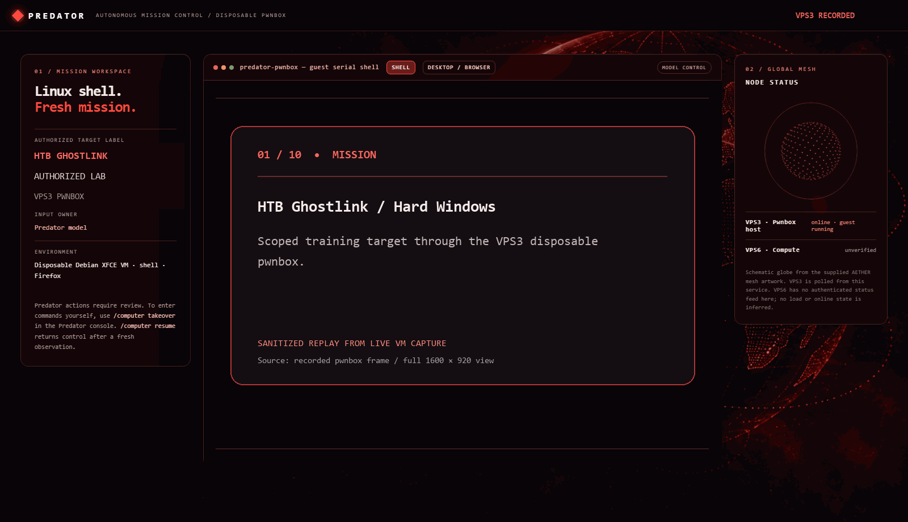

   
  <strong>AETHER AI · PREDATOR</strong>

  

  
  
  

# Predator

**Understand the path. Fix what matters. Show the evidence.**

Predator is Aether's security research and repair program. It combines **frontier-AI reasoning, adaptive compilation, and hybrid classical/quantum search** to investigate software, model threat paths, and check candidate repairs.

Teams can commission a focused repository mission, qualify a repeatable security profile, or scope an authorized live assessment. **Gen3 studies quantum depth:** research cycles that use the preceding cycle's evidence to refine the next question.

This repository is the **public showcase**: research notes, selected results, and training demos. The Predator CLI and operator engines are private; access is reviewed separately.

[Services](#ways-to-work-with-aether) · [Crucible](#crucible-adaptive-modeling-and-quantum-depth) · [Research sources](#research-sources) · [Results](#what-the-public-research-found) · [Workspace](#the-operator-workspace) · [HTB modules](#hack-the-box-modules-and-demos) · [Docs](#read-the-evidence)

> **[Read the safety model →](SAFETY.md)** Human-approved scope and budgets bound each run. Memory, model suggestions, and quantum results supply evidence; authority comes from the approved mission. The guide distinguishes required policy from controls proven in code.

## Ways to work with Aether

<table>
  <tr>
    <td width="50%" valign="top"></td>
    <td width="50%" valign="top"></td>
  </tr>
</table>

| Path | Best fit | Start here |
| :--- | :--- | :--- |
| **Predator Strikes** | A known CVE fix, focused discovery, or chain analysis for one agreed repository surface | [Discuss a Strike →](https://aethersystems.net/strikes/) |
| **Predator CI** | Repeatable checks against a qualified repository profile and exact commit; private preview | [Qualify a profile →](https://aethersystems.net/actions/design-partner) |
| **Predator Red Team** | An authorized assessment of a live environment, with reviewed findings and remediation | [Scope an assessment →](https://aethersystems.net/defense-stack) |

A mission begins with an agreed surface, acceptance checks, and handoff. Live assessments also require approved targets, methods, timing, contacts, and stop conditions. Current pricing and engagement terms are on the linked service pages. Broader engineering work starts with a [project inquiry](https://aethersystems.net/contact).

## Crucible: adaptive modeling and quantum depth

**Crucible is Predator's software research and repair loop.** It starts with a pinned source revision, a defined question, and fixed acceptance checks. AI reasoning develops candidates; adaptive compilation models their choices and constraints; search selects candidates for native validation.

### What happens in one cycle

| Step | What happens |
| :--- | :--- |
| **Pin** | Freeze the source revision, scope, evidence, and checks. |
| **Model** | Express candidate choices and constraints as a **QUBO**: a quadratic unconstrained binary optimization problem. Its energy is the modeled cost to minimize. |
| **Search** | Use the recorded solver to select a candidate. Each run identifies simulation or quantum hardware and its classical comparison. |
| **Validate** | Check the software itself, retain passes and failures, and save a checkpoint for a separately admitted continuation. |

**Predator runs fanout through CodePro.** Context retrieval supplies relevant material to parallel workers. The **System-2 shared intermediate representation (IR)** gives their analysis a common structure for consolidation back into the evidence trail, within the admitted scope and budget.

[Research roadmap →](docs/research/generations.md) · [System-2 orchestration](https://github.com/AetherAI3/AETHER-CLOUD/tree/main/lib/orchestrator/system2) · [Native compiler](https://github.com/AetherAI3/AETHER-CLOUD/tree/main/native) · [Benchmarks](https://github.com/AetherAI3/AETHER-CLOUD/tree/main/bench)

*Implementation links require repository access.*

### The compounding loop: quantum depth over ratchet cycles

Each cycle inherits the previous checkpoint's evidence and unresolved work. A failed check can reveal a missing constraint or a new repair obligation, shaping the next formulation.

**C0 → Q1 → C1 → Q2 → C2 → Q3 → C3**

- **C** marks a saved evidence checkpoint.
- **Q** marks a quantum-method intervention built from its parent evidence.
- **Quantum depth** counts dependent interventions in that chain. Circuit depth measures the circuit within one intervention.

The **ratchet** retains verified earlier results while checking the next candidate. Progress is measured at each stage, and failed candidates remain in the record. In the [CharLS case](docs/research/charls-q3.md), Q3 used C2's remaining repair obligation to move from **16/24 to 24/24** protected test passes, preserving all 16 earlier passes.

<strong>Research execution and current limits</strong>

The public CharLS and QPACK studies used quantum-circuit simulation. The [joint5 pilot](docs/research/ibm-fez-pilot.md) supplies a separate hardware record. When configured, [Jev](https://docs.typesafe.ai/introduction) provides structured triage; its use is recorded per run, and native checks establish software behavior.

Signed custody binds research stages to source and artifacts. Live signed acceptance and variable-depth custody remain under validation. Every continuation needs its own scope, budget, and admission.

Gen3's goal is attributable quantum advantage over credible AI-only and classical alternatives, with matched resources and independent replication. That advantage and a measured Jev contribution remain unestablished.

## Research sources

**416 unique modeled chains · 18 routing categories · October 3, 2026 registry snapshot**

| Source | What it contributes |
| :--- | :--- |
| **MITRE ATT&CK chain library** | Connected models of steps, prerequisites, and references. Coverage combines [MITRE ATT&CK](https://attack.mitre.org/tactics/enterprise/) with AI, [MCP](https://owasp.org/www-project-mcp-top-10/), and memory-safety categories. |
| **CVE research catalog** | A separate database of vulnerability source records, affected-product information, advisories, problem types, and scoring data. CVE IDs connect the records to chain anchors. |

**Research mode** follows chain/CVE references to develop cited hypotheses, counterexamples, and proposed extensions. **Drive** uses the admitted mission's pinned evidence for investigation and validation. Deep-cycle integration retrieves shortlisted full CVE cards before ranking and records what was reviewed.

The catalog supports [CVE JSON 5.x](https://github.com/CVEProject/cvelistV5) imports with separate NVD, CISA KEV, and FIRST EPSS enrichment. Coverage and freshness depend on completed imports and pinned snapshots. Chain additions require source review and appropriate native checks; a modeled path needs observed behavior before it becomes a finding.

## What the public research found

<table>
  <tr>
    <td width="50%" valign="top"></td>
    <td width="50%" valign="top"></td>
  </tr>
</table>

| Study | Recorded result | What it shows |
| :--- | :--- | :--- |
| **[CharLS Q3 repair](docs/research/charls-q3.md)** | **16/24 → 24/24** protected passes; eight gained, all earlier passes retained | A dependent repair closed the remaining obligation on real C++ source with deliberately introduced faults. |
| **[QPACK feedback study](docs/research/gen3-qpack-experiment1.md)** | **5/8** controlled faults found with feedback, versus **2/8** without it | Feedback helped in this exploratory campaign. The adaptive classical comparison was incomplete; quantum-selector benefit was not isolated. |

These studies used deliberately introduced faults. A fresh, previously undiscovered CVE finding has not been published. Discovery, matched comparisons, and the quantum-advantage objective remain active research.

### joint5 compiler: the IBM Fez hardware result

The **AQRC joint5** pilot compared ordinary and joint5 compilation on IBM Fez: one six-variable fixture, two poles, four circuits, and 1,024 shots per circuit in one hardware job.

| Measurement | Ordinary → joint5 | Change |
| :--- | :--- | :--- |
| Native two-qubit gates, each pole | **144 → 103** | **28.5% fewer** |
| Distance from ideal output, vulnerable pole | **0.3952 → 0.3165** | **19.9% lower** |
| Distance from ideal output, fixed pole | **0.4039 → 0.3080** | **23.7% lower** |

Lower total-variation distance means closer agreement with the ideal output distribution. **Expected energy worsened on both poles.** This is a narrow compiler-quality result from one acquisition, without independent confirmation; improved minimization and quantum advantage remain unestablished.

[Measurements and uncertainty →](docs/research/ibm-fez-pilot.md) · [Full-precision data →](docs/research/ibm-pilot.json)

## The operator workspace

The private **Predator CLI** brings research, tools, persistent evidence, and supported browser/VM workflows into one conversation. Operators choose an available Aether model and keep its actions attached to the source, artifacts, and approved scope.

| Capability | What it does |
| :--- | :--- |
| **Research, Crucible, and Drive** | Cross-reference chains and CVEs, review candidates, and run admitted validation stages. |
| **CodePro fanout** | Retrieve context for parallel workers and consolidate analysis through shared IR. |
| **Clean model worktrees** | Give each model run an isolated Git worktree, pinned source, stable identity, and attributed artifacts. |
| **Unlimited Context** | Retrieve relevant sources, notes, counterexamples, and unresolved questions across sessions and models. |
| **Predator RC** | View browser and CLI activity remotely through an encrypted relay, with human takeover and hand-back. |
| **HTB and VM workflows** | Work through supported Pwnbox/noVNC consoles or an owned VM in an authorized training lab. |

**[Unlimited Context (UCL)](https://github.com/AetherAI3/Unlimited-Context-LLM)** is Aether's open-source context engine. Named memory pools carry source-backed evidence across sessions; each model branch retains its own notes. “Unlimited” describes retrieval reach: relevant slices enter the model's native attention window. Restart checks verify task, worktree, and memory-pool identity.

<strong>Browser, RC, and guest-session status</strong>

Supported Pwnbox/noVNC sessions have recorded attachment, observation, reviewed input, human takeover, resume, and cleanup. An owned Ubuntu VM supplied the Academy workflow below. Other CTF, Sherlock, VM, and VPN environments need their own scope and validation.

RC is in controlled private preview. The production viewer and relay have been exercised in an owner canary; the complete sign-in, mission selection, and controller hand-back journey remains under validation. Browser and guest sessions require a fresh check after interruption.

## Hack The Box: modules and demos

Training records across HTB Academy, Satellite Exploitation, AI/ML Exploitation, and individual machines. Each guide explains the completion evidence and the Predator work that was saved.

| Module or track | Recorded progress | Open the guide |
| :--- | :--- | :--- |
| **Satellite Exploitation** | **9/9 labs completed** · October 5, 2026 | [Certificate, lab list, and replays](docs/htb/satellite-exploitation/README.md) |
| **AI and ML Exploitation** | **1/17 labs HTB-accepted** · in progress | [Lab status and three replays](docs/htb/ai-ml-exploitation/README.md) |
| **Academy: Network Enumeration with Nmap** | **12/12 sections completed** · October 3, 2026 | [Completion record and two replays](docs/htb/academy/README.md) |
| **Machine: BlockSynergy** | **User and root challenge files read** · October 5, 2026; owner confirmed | [Machine record and sanitized replay](docs/htb/machines/blocksynergy/README.md) |
| **Machine: Ghostlink** | **User and root challenge files read** · October 5, 2026; HTB submission unobserved | [Machine record and full-screen pwnbox replay](docs/htb/machines/ghostlink/README.md) |

For Academy, **Predator through GLM-5.3 ran the VM commands autonomously**. The owner supplied plain-language prompts and exercise questions, then entered the resulting answers in Academy. Execution roles for the other tracks are described in their guides.

The GIFs below are **evidence replays assembled from saved records**. The Satellite replay includes challenge spoilers. Ghostlink's public replay keeps the full pwnbox view while obscuring sensitive terminal content.

<table>
  <tr>
    <th width="50%">Academy · autonomous VM enumeration</th>
    <th width="50%">Satellite · recorded lab work</th>
  </tr>
  <tr>
    <td width="50%" valign="top"></td>
    <td width="50%" valign="top"></td>
  </tr>
</table>

 Ghostlink · full-screen VPS3 pwnbox replay · <a href="docs/htb/machines/ghostlink/README.md">evidence and execution roles</a>

The Satellite certificate and account activity support nine completed labs; the replay covers four saved lab records. AI/ML counts only HTB-accepted results toward completion.

**[Browse all HTB modules, certificates, and replays →](docs/htb/)**

### Disposable pwnbox for autonomous missions

Predator can spawn a disposable Linux pwnbox for an authorized CTF or HTB mission when a hosted Pwnbox is unavailable. After an operator confirms the VM, Predator can investigate through reviewed terminal actions. The operator can take over or stop it, and the disk is removed on stop or expiry.

A live VPS3 validation reached a seeded test flag through a reviewed `sonnet` command, with the result cited to a fresh guest observation. Watch, takeover, resume, lease fencing, and teardown checks passed.

## Developers: join the research program

Help advance the CLI, repair chains, verification tools, or careful classical/quantum comparisons. Tell us what you have built and which part of the program interests you. Private research access is granted after review.

[Apply to join →](https://aethersystems.net/contact?intent=general&product=site_wide&cta=footer_updates_contact)

## Read the evidence

| Start with | Then explore |
| :--- | :--- |
| **[HTB showcase guide](docs/htb/README.md)** | Tracks, machines, certificate, completion records, and replay index |
| **[CharLS Q3](docs/research/charls-q3.md)** | [Public data](docs/research/charls-q3.json) and the completed dependent repair |
| **[QPACK study](docs/research/gen3-qpack-experiment1.md)** | [Episode data](docs/research/gen3-qpack-experiment1.json), comparisons, and missing outcomes |
| **[joint5 IBM Fez pilot](docs/research/ibm-fez-pilot.md)** | [Public data](docs/research/ibm-pilot.json), uncertainty, and the energy regression |
| **[Research roadmap](docs/research/generations.md)** | Generation goals and the requirements for promoting research into qualified profiles |
| **[Predator safety model](SAFETY.md)** | Required boundaries and the status of implemented controls |
| **[Unlimited Context](https://github.com/AetherAI3/Unlimited-Context-LLM)** | [How it works](https://github.com/AetherAI3/Unlimited-Context-LLM#how-it-works) and [safety measures](https://github.com/AetherAI3/Unlimited-Context-LLM/blob/main/SAFETY.md) |

Public overview and selected research notes · Private operator engines © 2026 Aether AI LLC. All rights reserved. IBM is identified as a hardware provider; no affiliation or endorsement is implied. <a href="docs/assets/SOURCES.md">Visual sources</a>.

