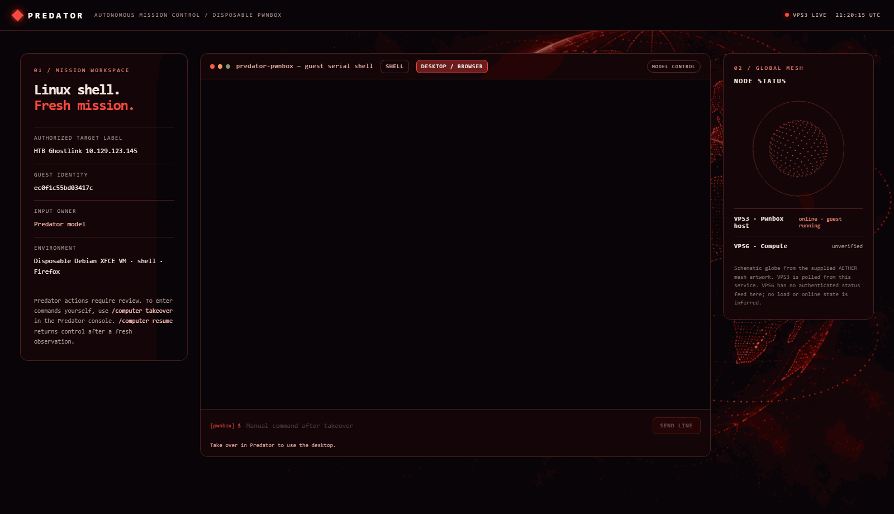
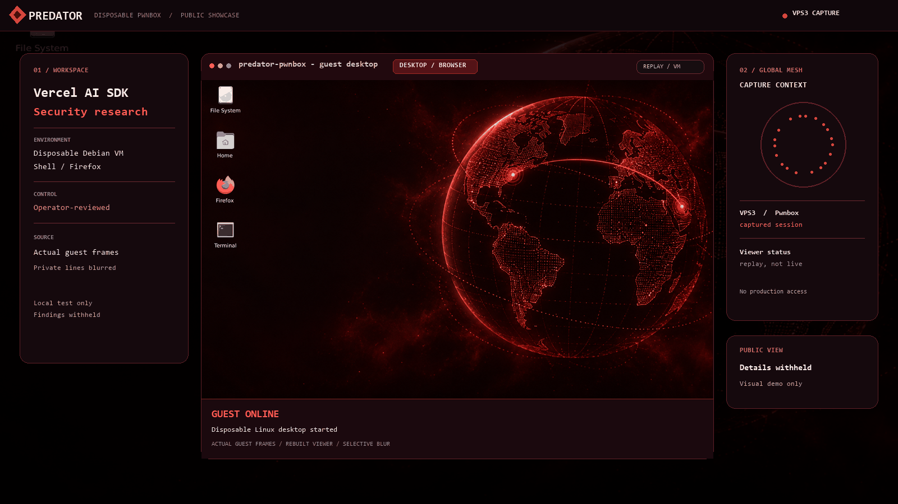
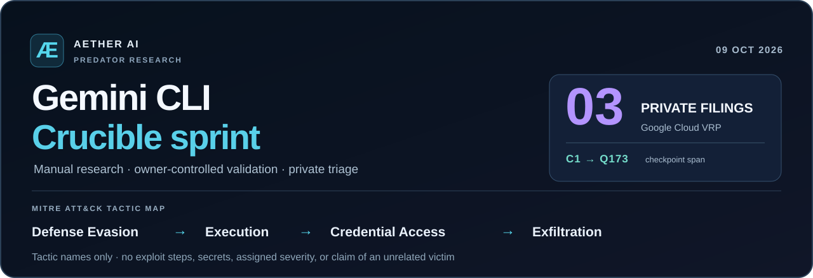
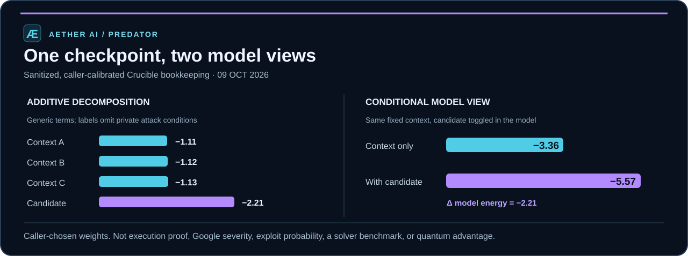
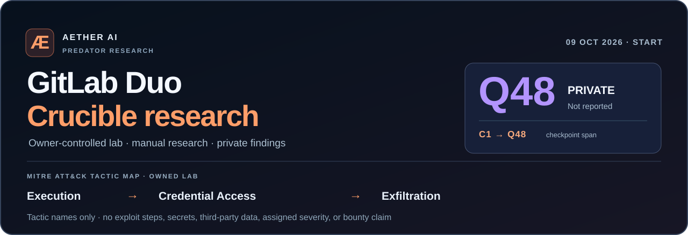
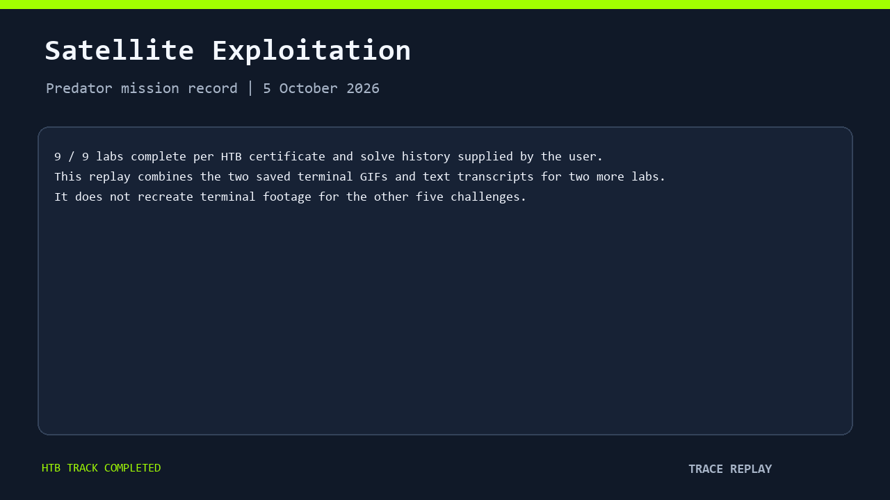
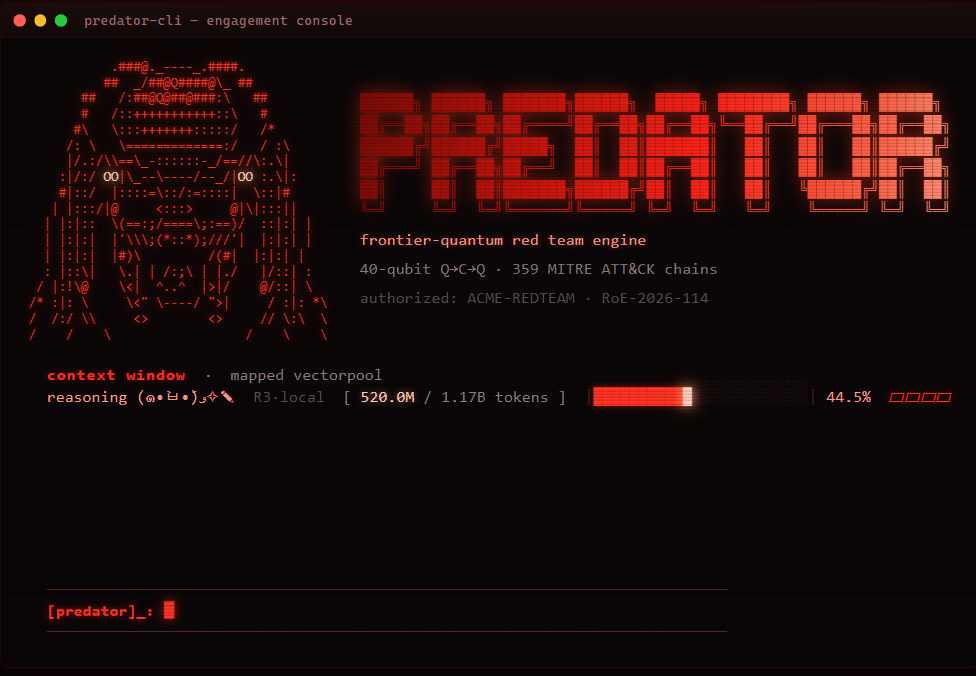

   
  <strong>AETHER AI · PREDATOR</strong>

  

  
  
  

# Predator

**AI security research, software repair, and authorized VM workflows.**

Predator brings AI reasoning, persistent context, and reviewed tool use into security research and software repair. Its research engine combines **adaptive compilation and hybrid classical/quantum search** to model threat paths and test candidate repairs.

This is the **public feature showcase and evidence collection**. The CLI and operator engines are private, with [reviewed research access](#developers-join-the-research-program).

[P-BOX](#p-box) · [HTB demos](#hack-the-box-training-and-evidence) · [MITRE chains](#mitre-attck-chain-library) · [CVE catalog](#cve-research-catalog) · [Crucible](#crucible-adaptive-quantum-threat-modeling) · [Results](#banked-scientific-results) · [Features](#predator-features) · [Work with Aether](#ways-to-work-with-aether) · [Docs](docs/README.md)

## [P-BOX] Predator's disposable Linux VM

**Give Predator a goal, confirm the VM, and follow along as it works.**

P-BOX is Predator's disposable Linux pwnbox for authorized CTF and HTB missions. Predator can spawn the VM when a hosted Pwnbox is unavailable, giving it a place to work that you can watch and control.

| What you can do | How it works |
| :--- | :--- |
| **Confirm and start** | You confirm the VM before Predator begins work within the approved mission. |
| **Work toward longer goals** | Predator works autonomously through reviewed terminal actions, reads fresh guest output, and chooses the next step within the approved mission. |
| **Watch, take over, and resume** | Watch the guest live, take control yourself, hand it back to Predator, or stop the mission. |
| **Clean up automatically** | The VM's disk is removed when you stop it or its lease expires. |

*The recording below includes challenge spoilers and visible lab command history.*

   
  P-BOX in action · Predator / GLM-5.3 · 670 recorded guest frames · <a href="docs/htb/machines/ghostlink/README.md">Ghostlink evidence and execution roles</a>

<strong>About this GLM-5.3 replay</strong>

The featured GIF comes from **Predator's GLM-5.3 Ghostlink mission in P-BOX**. It contains 670 recorded guest frames at 1600 × 920, with blank browser-loading frames removed. The [frame provenance](docs/htb/machines/ghostlink/replay-provenance.json) records the retained source-frame hashes and GIF hash.

The [machine guide](docs/htb/machines/ghostlink/README.md) records GLM-5.3's research and the operator's later actions. The screen recorder stopped before the final user and root challenge-file reads; those observations are documented separately.

### Vercel AI SDK: redacted local research replay

Predator's VPS3 P-BOX also supported a **local security test of the Vercel AI SDK**. The public replay shows the disposable Linux desktop and a verified local result. It uses synthetic values; no Vercel production account or service was accessed.

   
  Five actual guest captures · seven replay frames · selective FFmpeg blur · <a href="docs/pbox-vercel-ai-sdk-showcase.md">provenance and disclosure limits</a>

### Gemini CLI: private Crucible sprint

On **October 9, 2026**, Predator's manual research workflow ran a deep Gemini CLI Crucible sprint across the **C1 → Q173 checkpoint span**. Three separate reports were filed privately with Google Cloud VRP during the day. They remain under triage; no severity or reward has been assigned.

   
  Public taxonomy only: Defense Evasion → Execution → Credential Access → Exfiltration. No reproduction details or credential material.

<strong>Sanitized research energy</strong>

  

The two views show **one caller-calibrated model checkpoint**, with private attack-condition labels removed. Its weights are research bookkeeping; they do not independently verify a finding, measure exploit probability, establish quantum advantage, or set a Google bounty tier. Validation evidence remains in the private reports while triage is pending.

### GitLab Duo: private Crucible research

Predator began an owner-controlled GitLab Duo research sprint on **October 9, 2026** and extended its manual Crucible record across the **C1 → Q48 checkpoint span**; the final isolated validation was recorded on **October 10 UTC**. The local result maps at the [MITRE ATT&CK](https://attack.mitre.org/tactics/) tactic level to **Execution → Credential Access → Exfiltration**. This is a research map of an owned test, not a claim about an attack on another user.

**Private findings: technical details have not been disclosed and no vulnerability report has been filed.** No severity or bounty has been assigned. The saved evidence does not establish zero-click execution or a sandbox escape.

   
  Owner-controlled validation · tactic names only · no reproduction steps, secrets, or third-party data

## Hack The Box: training and evidence

**HTB is a test and training ground for Predator's agent and VM workflows.** These two examples show autonomous VM command work and saved lab research, with completion records and execution roles in their guides.

*The Satellite replay includes challenge spoilers. Both GIFs are assembled evidence replays.*

<table>
  <tr>
    <th width="50%">Nmap course · autonomous VM work</th>
    <th width="50%">Satellite Exploitation · recorded lab work</th>
  </tr>
  <tr>
    <td width="50%" valign="top"></td>
    <td width="50%" valign="top"></td>
  </tr>
  <tr>
    <td width="50%" valign="top"><strong>12/12 Academy sections completed.</strong> Predator through GLM-5.3 ran the VM commands autonomously. The owner supplied prompts and exercise questions, then entered the answers. <a href="docs/htb/academy/README.md">Course record and replays →</a></td>
    <td width="50%" valign="top"><strong>9/9 labs completed.</strong> The certificate and account activity support completion; the replay covers four saved lab records. <a href="docs/htb/satellite-exploitation/README.md">Certificate, lab list, and replays →</a></td>
  </tr>
</table>

<strong>More HTB records and replay notes</strong>

| Module or track | Recorded progress | Open the guide |
| :--- | :--- | :--- |
| **Academy: Network Enumeration with Nmap** | **12/12 sections completed** · October 3, 2026 | [Completion record and two replays](docs/htb/academy/README.md) |
| **Satellite Exploitation** | **9/9 labs completed** · October 5, 2026 | [Certificate, lab list, and replays](docs/htb/satellite-exploitation/README.md) |
| **AI and ML Exploitation** | **1/17 labs HTB-accepted** · in progress | [Lab status and three replays](docs/htb/ai-ml-exploitation/README.md) |
| **Machine: BlockSynergy** | **User and root challenge files read** · October 5, 2026; owner confirmed | [Machine record and sanitized replay](docs/htb/machines/blocksynergy/README.md) |
| **Machine: Ghostlink** | **User and root challenge files read** · October 5, 2026; HTB submission unobserved | [Machine record and full-screen pwnbox replay](docs/htb/machines/ghostlink/README.md) |

The [earlier Pwnbox console preview](docs/media/predator-pwnbox-ttl-preview.gif) shows a separate reviewed guest-session check. AI/ML counts only HTB-accepted results toward completion. The machine guides distinguish Predator research from operator execution and explain what their recordings contain.

**[Browse all HTB modules, certificates, and replays →](docs/htb/README.md)**

## MITRE ATT&CK chain library

**416 modeled chains · 18 routing categories · October 3, 2026 registry snapshot**

Predator's chain library connects steps, prerequisites, and source references into models of how weaknesses can combine. It brings together [MITRE ATT&CK](https://attack.mitre.org/tactics/enterprise/) with AI, [MCP](https://owasp.org/www-project-mcp-top-10/), and memory-safety categories.

| What a chain contains | Why it helps |
| :--- | :--- |
| **Connected steps** | Show how a proposed path depends on earlier conditions. |
| **Prerequisites and references** | Keep the model tied to stated assumptions and cited sources. |
| **Routing category** | Organize the review around the relevant research surface. |

**Research mode** follows chain and CVE references to develop cited hypotheses, counterexamples, and proposed extensions. Source review and appropriate checks on the software must establish observed behavior before a modeled path becomes a finding.

## CVE catalog and database

**Vulnerability source records linked to the chain library.**

Predator maintains a separate catalog of CVE records, affected products, advisories, problem types, and scoring data. CVE IDs connect those records to chain anchors so an investigation can follow the underlying evidence.

| Part of the catalog | What it contributes |
| :--- | :--- |
| **CVE source records** | [CVE JSON 5.x](https://github.com/CVEProject/cvelistV5) imports and affected-product information. |
| **Separate enrichment** | NVD, CISA KEV, and FIRST EPSS data alongside the source records. |
| **Research review** | Deep-cycle integration reads shortlisted full CVE cards before ranking and records what was reviewed. |

**Drive** uses the approved mission's pinned evidence for investigation and validation. Catalog coverage and freshness depend on completed imports and pinned snapshots.

## Crucible: adaptive quantum threat modeling

**Model a threat path, test a candidate, and carry the evidence forward.**

Crucible is Predator's software research and repair loop. It starts with a pinned source revision, a defined question, and fixed acceptance checks. AI reasoning develops candidate threat paths and repairs; adaptive compilation expresses their choices and constraints for hybrid classical/quantum search. Checks on the software establish what each candidate actually does.

### What happens in one cycle

| Step | What happens |
| :--- | :--- |
| **Pin** | Freeze the source revision, scope, evidence, and acceptance checks. |
| **Model** | Compile candidate choices and constraints into a **QUBO**, a binary optimization model with a cost to minimize. |
| **Search** | Use the recorded solver to select a candidate, identifying simulation or quantum hardware and its classical comparison. |
| **Validate** | Check the software, retain passes and failures, and save the evidence for a separately approved continuation. |

### Quantum depth

The compounding loop uses each checkpoint's evidence and unresolved work to shape the next intervention. A failed check can reveal a missing constraint or a remaining repair obligation.

**C0 → Q1 → C1 → Q2 → C2 → Q3 → C3**

| Label | Meaning |
| :--- | :--- |
| **C** | A saved evidence checkpoint. |
| **Q** | A quantum-method intervention built from its parent evidence. |
| **Quantum depth** | The number of dependent interventions in the chain; circuit depth measures the circuit within one intervention. |

The **ratchet** preserves verified earlier results while checking the next candidate. Failed candidates stay in the record. In the [CharLS case](docs/research/charls-q3.md), Q3 used C2's remaining repair obligation to move from **16/24 to 24/24** protected test passes, retaining all 16 earlier passes.

[Research roadmap →](docs/research/generations.md)

<strong>Methods, evidence, and current limits</strong>

QUBO stands for quadratic unconstrained binary optimization. Its energy is the modeled cost to minimize; a candidate still needs checks on the software.

The public CharLS and QPACK studies used quantum-circuit simulation. The [joint5 pilot](docs/research/ibm-fez-pilot.md) supplies a separate hardware record. When configured, [Jev](https://docs.typesafe.ai/introduction) provides structured triage; its use is recorded per run.

Signed custody binds research stages to source and artifacts. Live signed acceptance and variable-depth custody remain under validation. Each continuation needs its own scope, budget, and admission.

Gen3 seeks attributable quantum advantage over credible AI-only and classical alternatives, with matched resources and independent replication. Quantum advantage and a measured Jev contribution remain unestablished.

## Banked scientific results

**Published outcomes with linked notes, data, and limits.** “Banked” means the result and its evidence are retained.

<table>
  <tr>
    <td width="50%" valign="top"></td>
    <td width="50%" valign="top"></td>
  </tr>
</table>

| Study | Recorded result | What it shows |
| :--- | :--- | :--- |
| **[CharLS Q3 repair](docs/research/charls-q3.md)** | **16/24 → 24/24** protected passes; eight gained, all earlier passes retained | A dependent repair closed the remaining obligation on real C++ source with deliberately introduced faults. |
| **[QPACK feedback study](docs/research/gen3-qpack-experiment1.md)** | **5/8** controlled faults found with feedback, versus **2/8** without it | Feedback helped in this exploratory campaign. The adaptive classical comparison was incomplete; quantum-selector benefit was not isolated. |

The CharLS and QPACK studies used deliberately introduced faults. A newly discovered CVE finding has not been published. Discovery, matched comparisons, and quantum advantage remain active research objectives.

### joint5: IBM Fez compiler pilot

The **AQRC joint5** pilot compared ordinary and joint5 compilation on IBM Fez: one six-variable fixture, two poles, four circuits, and 1,024 shots per circuit in one hardware job.

| Measurement | Ordinary → joint5 | Change |
| :--- | :--- | :--- |
| Native two-qubit gates, each pole | **144 → 103** | **28.5% fewer** |
| Distance from ideal output, vulnerable pole | **0.3952 → 0.3165** | **19.9% lower** |
| Distance from ideal output, fixed pole | **0.4039 → 0.3080** | **23.7% lower** |

Lower total-variation distance means closer agreement with the ideal output distribution. **Expected energy worsened on both poles.** The pilot records one acquisition without independent confirmation. Improved minimization and quantum advantage remain unestablished.

[Measurements and uncertainty →](docs/research/ibm-fez-pilot.md) · [Full-precision data →](docs/research/ibm-pilot.json)

## Predator features

The private **Predator CLI** brings research, tools, and persistent evidence into one conversation. Choose an available Aether model, keep each run attached to its sources and approved scope, and continue from saved work.

| Capability | What it does |
| :--- | :--- |
| **Research and Drive** | Cross-reference chains and CVEs, review candidates, and run approved investigation and validation stages. |
| **CodePro fanout** | Give parallel workers relevant context and bring their analysis into one evidence trail. |
| **Clean model worktrees** | Keep each model run in its own Git worktree, with pinned source and attributed artifacts. |
| **Unlimited Context** | Retrieve sources, notes, counterexamples, and open questions across sessions and models. |
| **Predator RC** | Follow browser and CLI activity through an encrypted relay, take over, and hand control back. |
| **[P-BOX](#p-box)** | Spawn a disposable Linux pwnbox for a confirmed mission, with live viewing, operator control, and automatic cleanup. |
| **Guest consoles** | Work through supported Pwnbox/noVNC sessions or an owned VM in an authorized training lab. |

**Predator runs fanout through CodePro.** Context retrieval supplies relevant material to parallel workers. The **System-2 shared intermediate representation (IR)** gives their analysis a common structure for consolidation into the evidence trail, within the approved scope and budget.

<strong>CodePro implementation links</strong>

[System-2 orchestration](https://github.com/AetherAI3/AETHER-CLOUD/tree/main/lib/orchestrator/system2) · [Native compiler](https://github.com/AetherAI3/AETHER-CLOUD/tree/main/native) · [Benchmarks](https://github.com/AetherAI3/AETHER-CLOUD/tree/main/bench)

*Implementation links require repository access.*

**[Unlimited Context (UCL)](https://github.com/AetherAI3/Unlimited-Context-LLM)** keeps source-backed evidence in named memory pools across sessions. Each model branch retains its own notes. “Unlimited” describes retrieval reach: relevant slices enter the model’s normal attention window. Restart checks verify the task, worktree, and memory-pool identity.

<strong>Browser, RC, and guest-session status</strong>

Supported Pwnbox/noVNC sessions have recorded attachment, observation, reviewed input, human takeover, resume, and cleanup. An owned Ubuntu VM supplied the Academy workflow shown earlier. Other CTF, Sherlock, VM, and VPN environments need their own scope and validation.

RC is in controlled private preview. The production viewer and relay have been exercised in an owner validation; the complete sign-in, mission selection, and controller hand-back journey remains under validation. Browser and guest sessions require a fresh check after interruption.

## Ways to work with Aether

Commission a focused repository mission, qualify a repeatable security profile, or scope an authorized live assessment.

<table>
  <tr>
    <td width="50%" valign="top"></td>
    <td width="50%" valign="top"></td>
  </tr>
</table>

| Path | Best fit | Start here |
| :--- | :--- | :--- |
| **Predator Strikes** | A known CVE fix, focused discovery, or chain analysis for one agreed repository surface | [Discuss a Strike →](https://aethersystems.net/strikes/) |
| **Predator CI** | Repeatable checks against a qualified repository profile and exact commit; private preview | [Qualify a profile →](https://aethersystems.net/actions/design-partner) |
| **Predator Red Team** | An authorized assessment of a live environment, with reviewed findings and remediation | [Scope an assessment →](https://aethersystems.net/defense-stack) |

Agree on the surface, acceptance checks, and handoff before work begins. Live assessments also require approved targets, methods, timing, contacts, and stop conditions. The linked service pages list current pricing and terms; broader engineering work starts with a [project inquiry](https://aethersystems.net/contact).

> **[Read the safety model →](SAFETY.md)** Human-approved scope and budgets bound each run. Memory, model suggestions, and quantum results supply evidence; authority comes from the approved mission. The guide distinguishes required policy from controls proven in code.

## Join the community

Ask about the published studies, suggest a public demo, or share feedback in [GitHub Discussions](https://github.com/AetherAI3/Predator/discussions). Use [issues](https://github.com/AetherAI3/Predator/issues/new/choose) for concrete documentation corrections.

[Contributing guide](CONTRIBUTING.md) · [Community guidelines](CODE_OF_CONDUCT.md) · [Security reporting](SECURITY.md)

## Developers: join the research program

Help build the CLI, repair chains, verification tools, or classical/quantum comparisons. Tell us what you have built and where you want to contribute. Private research access is reviewed separately.

   
  Predator CLI console preview · illustrative layout and counters

[Apply to join →](https://aethersystems.net/contact?intent=general&product=site_wide&cta=footer_updates_contact)

## Read the evidence

| Start with | Then explore |
| :--- | :--- |
| **[P-BOX feature showcase](#p-box)** | VM lifecycle, operator control, and recorded guest session |
| **[HTB training evidence](docs/htb/README.md)** | Courses, tracks, machines, certificates, and replay index |
| **[MITRE chains](#mitre-attck-chain-library) and [CVE catalog](#cve-research-catalog)** | Research models and linked vulnerability source records |
| **[CharLS Q3](docs/research/charls-q3.md)** | [Public data](docs/research/charls-q3.json) and the completed dependent repair |
| **[QPACK study](docs/research/gen3-qpack-experiment1.md)** | [Episode data](docs/research/gen3-qpack-experiment1.json), comparisons, and missing outcomes |
| **[joint5 IBM Fez pilot](docs/research/ibm-fez-pilot.md)** | [Public data](docs/research/ibm-pilot.json), uncertainty, and the energy regression |
| **[Research roadmap](docs/research/generations.md)** | Generation goals and the requirements for promoting research into qualified profiles |
| **[Predator safety model](SAFETY.md)** | Required boundaries and the status of implemented controls |
| **[Unlimited Context](https://github.com/AetherAI3/Unlimited-Context-LLM)** | [How it works](https://github.com/AetherAI3/Unlimited-Context-LLM#how-it-works) and [safety measures](https://github.com/AetherAI3/Unlimited-Context-LLM/blob/main/SAFETY.md) |

Public overview and selected research notes · Private operator engines © 2026 Aether AI LLC. All rights reserved. IBM is identified as a hardware provider; no affiliation or endorsement is implied. <a href="docs/assets/SOURCES.md">Visual sources</a>.

