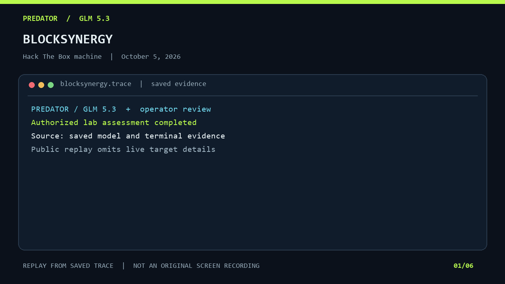

# BlockSynergy

**HTB machine · Insane · Linux · completed October 5, 2026.** The user and root challenge files were read from the live, authorized lab machine, and the owner confirmed the result. A separate HTB account submission was not observed.

The [six-frame GIF](predator-replay.gif) is a **sanitized replay assembled from saved model output and terminal evidence**. Every frame identifies it as a replay. The public version omits the target address, credentials, flag values, precise timing, file paths, and exploit commands. Its SHA-256 hash and frame count are in the [HTB media manifest](../../media-manifest.json).

## Execution roles and evidence

| Role | Recorded contribution |
| --- | --- |
| **Predator / GLM 5.3** | Reviewed the pinned attack-chain catalog and identified a generic SUID privilege-escalation chain and a TOCTOU primitive as research context. The model explicitly treated these as hypotheses before live validation. |
| **Operator** | Ran the authorized lab checks, observed the privilege-escalation result, read both challenge files, and removed temporary access and test artifacts. |
| **Owner** | Confirmed the reported flags in the chat. |

The live root verification showed effective UID 0. The development service was restored and returned HTTP 200 after cleanup. The custom application and restore behavior were **not assigned a CVE**; a generic MITRE chain is research context, not a verified product vulnerability.

## Later workflow review

After the machine was completed, a separate **offline** CodePro/Crucible repair review examined Predator's model routing and latency. Two seven-role DSV4 Flash research passes and GLM 5.3 reviews produced proposals; a source audit refuted several claims and left others unresolved. No mixed-model Drive dispatch, CodePro repair, or measured speedup resulted from that review. It did not participate in the BlockSynergy solve or generate the GIF above.

The full trace and challenge answers remain in the private Predator task record. This page records the outcome and attribution without publishing an active-machine solution.

[All machines →](../README.md) · [All HTB work →](../../README.md)
