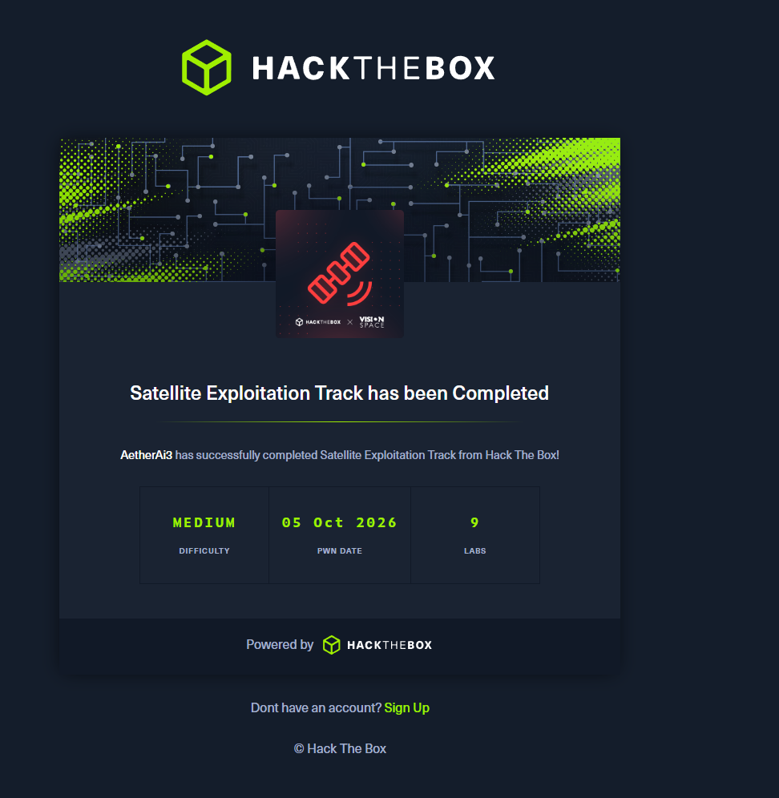

# Satellite Exploitation

**Completed: 9/9 labs · 5 October 2026.** The owner supplied the HTB certificate for AetherAi3 and nine solve-history entries. [Open the achievement on Hack The Box →](https://labs.hackthebox.com/achievement/track/4038252/99)

## The nine labs

| Lab | HTB result | Saved Predator trace |
| --- | --- | --- |
| Baby Frame | Solved in account activity | [Individual replay](baby-frame-replay.gif) |
| Echoes in Orbit | Solved in account activity | No local run trace in the source archive |
| Scalped Platform | Solved in account activity | No local run trace in the source archive |
| Groundstation Breach | Solved in account activity | No local run trace in the source archive |
| Signal from Space | Solved in account activity | No local run trace in the source archive |
| Space Ops | Solved in account activity | No local run trace in the source archive |
| First Contact | Solved in account activity | Terminal transcript represented in the combined replay |
| Antenna Pointing | Solved in account activity | Terminal transcript represented in the combined replay |
| No Errors | Solved in account activity | [Individual replay](no-errors-replay.gif) |

## Watch the recorded work

The 46-frame [combined Predator replay](combined-replay.gif) joins the original Baby Frame and No Errors GIFs with cards made from the saved First Contact and Antenna Pointing terminal transcripts, then shows the certificate. It does not reconstruct the other five labs.

Watch the combined replay (challenge spoilers)

Individual source replays: [Baby Frame](baby-frame-replay.gif) · [No Errors](no-errors-replay.gif). Their role and SHA-256 digests, along with the combined replay and certificate, are listed in the [media manifest](../media-manifest.json).

The certificate image is owner-supplied. The linked HTB achievement is the external account record; this page does not imply a separate Predator run for every completed lab.

[All HTB work →](../README.md)
