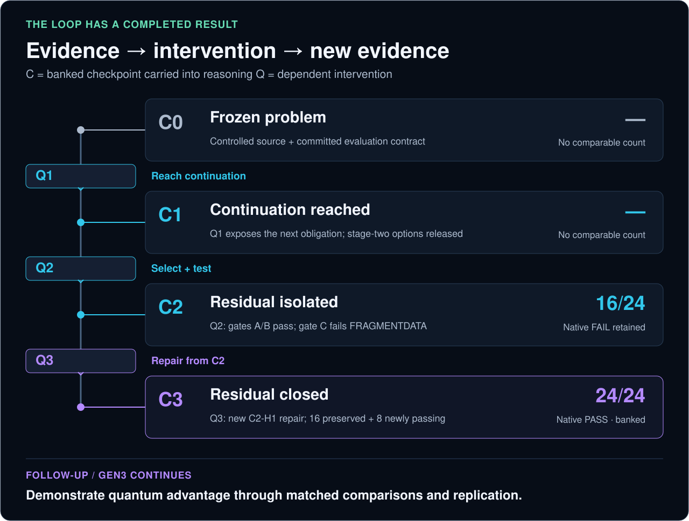

# CharLS Q3 — the first Gen3 repair win

[← Predator overview](../../README.md) · [Public result data](charls-q3.json) · [Research objective](generations.md)

**Completed September 14, 2026. Published September 15, 2026.**

Gen3 has its first completed dependent-repair win in the Aether Predator program: **Q3 closed all 24 evaluated CharLS cases, preserving 16 prior passes and adding eight.** Native feedback from Q2 became the evidence parent for a separately prepared Q3 repair. C3 is banked. Gen3 continues toward its objective: **demonstrating quantum advantage under credible comparisons.**

## What was solved

The benchmark used real CharLS C++ source with deliberately introduced faults. **24/24 means 24 deterministic private campaign test cases pass.** It does not mean 24 vulnerabilities, a newly discovered production CVE or an established exploit severity.

The final repair concerned fragment concatenation. `mapping_table_entry::copy` copied each fragment in full but advanced the destination by `data_fragment.size() − 1`. The next fragment began one byte too early, overwriting the preceding fragment’s last byte and leaving part of the destination unwritten. Q3 candidate **C2-H1** advanced by the complete fragment length. This explains the repaired behavior; it does not settle every possible reason Q2’s candidate generation or objective left the obligation open.

We classify that mechanism as consistent with [MITRE CWE-193: Off-by-one Error](https://cwe.mitre.org/data/definitions/193.html). This connects the controlled defect to a documented software-weakness class; it does not establish exploitability or severity for this benchmark.

Controlled faults make the expected behavior and dependencies explicit. The result establishes successful repair and preservation under that contract; discovery and transfer to unseen faults require separate evidence.

## The completed chain

| Stage | Recorded transition | Comparable protected utility |
| :--- | :--- | :--- |
| **C0 → Q1 → C1** | Q1’s native transition reached a deeper continuation; committed stage-two options were released | Not supplied for C0/C1 |
| **C1 → Q2 → C2** | Q2 selected the frozen continuation repair; gates A/B passed, C failed `FRAGMENTDATA` | **16/24** |
| **C2 → Q3 → C3** | A new C2-directed fragment repair closed the residual while retaining the prior passes | **24/24** |

**C labels an evidence checkpoint carried into later reasoning; Q labels an intervention.** Chain depth counts dependent interventions. It is separate from circuit depth, graph treewidth and the number of operational attempts.

Q3 changed the **candidate patch and its parent binding**. C2-H1 was prepared from C2 on Q2’s result tree; it was not the unused stage-two option released at C1. Q3 retained the optimization arithmetic and decoder semantics and used a **one-candidate catalog**. The improvement demonstrates that the dependent repair worked, not that a stronger optimizer was introduced.

Historical Q2 remains `CHARLS_Q2_EXECUTED_NATIVE_FAIL`. Its policy linkage is verified; its broader cause classification remains unresolved. A successful later repair does not rewrite a failed earlier experiment.

## The measured lift

| Primary measure | Result |
| :--- | ---: |
| Protected cases passing at C2 | 16/24 · 66.7% |
| Protected cases passing at C3 | **24/24 · 100%** |
| New protected passes | **+8** |
| Prior protected passes preserved | **16/16** |
| Prior protected passes lost | **0** |
| Absolute pass-rate lift | **+33.3 percentage points** |

**Supporting validation:** 516/516 stock tests, including 17/17 compliance; sanitizer PASS; 10,000 fuzz executions. The compliance cases are included in the stock total. Fuzz executions are additional validation activity, not additional protected cases. Zero regressions describes the evaluated obligations, not a guarantee about every possible input.

This is a measured C2→C3 improvement. The public record supplies no comparable C0 or C1 count, so it does not support a four-point utility curve or an accelerating-gain claim.

## The actual quantum-selection record

Q1 and Q2 used **Aer simulation**. For Q2, the recovered certificate records **2,048 samples** with bit order `[t17, t42]`:

| State | Samples | Feasible? | Frozen energy | Decision |
| :--- | ---: | :--- | ---: | :--- |
| `00` | 635 | No | — | Rejected |
| `01` | 291 | Yes | **1/4** | **Selected: t42** |
| `10` | 324 | Yes | 2 | Feasible alternative |
| `11` | 798 | No | — | Rejected |

There were **615 feasible samples and 1,433 rejected samples**. The policy selected the lowest exact energy among feasible sampled states, not the most frequent state. `01` was the unique feasible optimum; the feasible energy gap was 7/4 and regret was zero. Exact classical selection agreed and its own native replay reached the same failed C gate. Resource parity was not asserted.

These data support correct execution of that frozen objective. They do not support sampler tuning as the explanation for Q2’s residual. Q3’s singleton catalog supplies no optimizer comparison; its raw sample histogram is not supplied in this public summary. The older [IBM Fez hardware pilot](ibm-fez-pilot.md) is a separate experiment, not hardware evidence for this CharLS chain.

For the documented logical option encoding, Q2 has two vertices joined by one edge (treewidth **1**); Q3 has one vertex and no pairwise edge (treewidth **0**). A bag containing both Q2 vertices, and a singleton bag for Q3, attain these widths; Q2’s edge supplies its matching lower bound. These are source-derived graph facts, not new receipt measurements or a measure of CharLS program complexity. No inference about quantum advantage follows from a large source program.

## What is established, and what follows

**Established:** AI-assisted source reasoning, QUBO selection and native feedback formed a dependent repair chain that closed the remaining obligation on real C++ source while preserving the evaluated prior passes. This is Aether’s first Gen3 repair milestone, not a priority claim about the wider research field.

**Next objective:** demonstrate an attributable quantum advantage over strong AI-only and classical alternatives, with prospectively matched information access, native-query budgets, total resource accounting, uncertainty and independent replication. The source change, the selector’s contribution and the full system’s contribution need to be distinguished.

Before protected Q3, development already reported **516/516 public tests passing and 68 source/include files matching pinned upstream**. That inherited outcome knowledge limits novelty and blindness claims. A future transfer test must distinguish learning a reusable repair rule from restoring known upstream behavior. No matched Q3 advantage comparison, unseen-task transfer or quantum-hardware advantage is established here.

The case is complete; the program remains active. **No Q4 was started by the closeout, and this report launches no experiment.**

## Evidence, replay and operational reconciliation

This public note is an approved summary of the recovered ATLAS certificate, source contracts and completed execution-lane closeout. The producer reports successful Ed25519 signature verification and C2, candidate, tree, verifier, corpus and instrumentation bindings. It reports banking **17 C3 objects**, each read back with complete SHA-256 verification. This editorial review did not independently reverify the private signed bytes.

The native outcome is **PASS** and C3 is **BANKED**. The hosted ActionRun remains **failed/lost**: its completion endpoint returned HTTP 422 when five-field hosted check rows were compared with signed three-field rows. The orchestration failure and the authenticated native outcome are retained separately. Earlier failures and the owner-authorized retry remain in the history; banking caused no further native execution. Both failed and successful native outcomes count in the research record.

**What readers can reproduce here:** the public arithmetic and figures, using [charls-q3.json](charls-q3.json) and `python3 docs/assets/build_readme_assets.py`. The completed chain’s replay and lineage verification are producer-reported from the recovered private bundle. This repository alone does **not** provide independent end-to-end campaign reproduction: private inputs, patch bytes, raw receipts and trust material are not distributed here. Complete attempt exposure and cost totals are also not supplied.

<strong>Published checkpoint and durability fingerprints · SHA-256</strong>

| Identity | Full digest |
| :--- | :--- |
| C0 | `ade2df97519110fd91f656b1dcac4d0d830f475609e49c1aa1932edba74cf5c4` |
| C1 | `679d8a6ba1ecb7ecf49776588cb57bdd8f5b629812321a231c3623d2b4f7cf58` |
| C2 | `b80540199b4f2f27b0ea7f028b5bcb529a9dcdb1c59cfb7d36fd3e5f9b513851` |
| C3 | `31dcab98677b6aa9008a1eed107a9d895e57fbc80dab0a1d5e0dcefefe786790` |
| C3 durability receipt | `2eae45c6c2ac2f104f1b657dd3480f8b0407ae7b92151c2dcbd84c9f644179d5` |

Fingerprints identify the retained records. Hashes alone do not make unpublished evidence independently verifiable.

