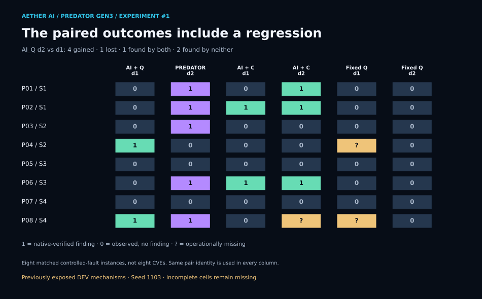

# GEN3 experiment #1: does verified feedback improve the next search?

**Closed exploratory campaign · September 19, 2026 · producer-reported native outcomes**

Predator’s feedback variant found **5/8 controlled faults**, versus **2/8** for the same AI + quantum-method system without intermediate feedback: **+37.5 percentage points**, or **2.5× the observed finding rate**. This is evidence worth replicating. The incomplete adaptive classical comparator prevents a claim of superiority over that system.

[Public episode data](gen3-qpack-experiment1.json) · [Figure builder and validator](../assets/build_gen3_qpack_assets.py) · [Repository overview](../../README.md)

## What ran

The frozen upstream source was [`ngtcp2/nghttp3` at `e30d4ed49dfb4a6a58e2987b53106d5c10b0c12e`](https://github.com/ngtcp2/nghttp3/tree/e30d4ed49dfb4a6a58e2987b53106d5c10b0c12e), specifically `lib/nghttp3_qpack.c`. Eight matched pairs each contained a deliberately faulted nghttp3 QPACK instance and a pristine control. Six variants ran across those 16 instances: **96 scheduled episodes**, not 96 independent bugs. Four bookkeeping mechanisms were represented: acknowledgment isolation, cancellation isolation, acknowledgment order, and known-received count bounds. DEV mechanisms had already been exposed. Seed block: **1103**.

| Family | Formulation | Search |
| :--- | :--- | :--- |
| `AI_Q` | Frozen Gemini formulation and reformulation | QAOA p=1, Aer matrix-product-state simulation |
| `AI_C` | Identical model, compiler path and permitted information | Qualified sparse enumeration, seeded local search and semantic beam portfolio |
| `FIXED_Q` | Fixed policy, no model calls | Same quantum-method family; real stage-two semantic exclusion |

The model binding was `google/gemini-3-flash-preview`, canonical revision `google/gemini-3-flash-preview-20251217`, temperature 0, low reasoning effort and zero retries. DeepSeek V4 Pro was used only in failed preliminary qualification, not the measured campaign. This comparison does not establish that the classical portfolio is the best possible classical method.

Each variant received two searches and two native checks. **d1:** search, search, check, check. **d2:** search, check, search, check. `AI_Q_d2` is the intended Predator loop: AI → compiled QUBO → optimizer → native feedback → AI reformulation → optimizer → native check. These depths describe feedback timing; both quantum-method variants used circuit depth p=1. Optimizer slots were capped at 40 seconds, native checks at 20 seconds, and episodes at 400 seconds. These are the DEV follow-up bounds, not the earlier deferred QPACK pilot’s envelope.

## Six rows, with missingness retained


| Variant | Findings / scheduled fault instances | Complete finding rate | Operationally missing |
| :--- | ---: | ---: | ---: |
| `AI_Q_d1` | 2/8 | 25.0% | 0 |
| **`AI_Q_d2` — Predator** | **5/8** | **62.5%** | **0** |
| `AI_C_d1` | 2/8 | 25.0% | 0 |
| `AI_C_d2` | 3/8 scheduled | **Unavailable** | 1 |
| `FIXED_Q_d1` | 0/8 scheduled | **Unavailable** | 2 |
| `FIXED_Q_d2` | 0/8 | 0% | 0 |

**R_Q = +37.5 percentage points** compares Predator with its no-feedback AI_Q control. **A_DEV = +62.5 points** compares Predator with Fixed-Q d2. Classical ratchet lift (`R_C`), the adaptive cross-arm difference (`D_DEV`) and the difference in ratchet lift (`I_DEV`) remain **null**. Reading 3/8 scheduled as a complete classical rate would conceal a missing outcome.

Both AI families had two first-stage findings, but the same counts do not identify the same cases. Within Predator’s d2 episodes, three additional findings first appeared at stage two. Across the paired d1/d2 outcomes, the change was **four gains, one loss, one found by both, two found by neither**. These are different summaries of the same campaign, not interchangeable counts.



One fault changes a complete eight-instance rate by 12.5 points. No statistical significance, general advantage, scaling law, new vulnerability, exploit chain, CVE assignment or vendor acceptance is established here.

## A graph of evidence, not an invented energy landscape


The diagram is generated from actual records. **E002 / P01** moves from `REFUTED` to `VERIFIED_FINDING` after reformulation. **E095 / P08** moves from `VERIFIED_FINDING` to `REFUTED`; the episode retains its valid first-stage finding. A ratchet does not imply that every subsequent candidate succeeds.

Each stage carries a proposal digest, compilation digest, selected-assignment and semantic-trace digests, and linked native-result and receipt fingerprints. The public identifiers E001–E096 and P01–P08 normalize episode order and pair identity. Full fingerprints and all six variants’ trajectories are in the JSON.

The two E002 selections both have local energy −17, yet their native outcomes differ. Different formulations define different objectives: their energy values cannot be compared as a common physical or optimization landscape. The heatmap shows native finding outcomes; it does not depict quantum amplitudes, superposition or a reconstructed code-energy surface. Raw source maps and receipts are not distributed here.

Predator’s selected assignment equaled the AI starting assignment in **30 of 31 recorded selection stages**. The one absent selection stage is not imputed. This is a major attribution limit: the loop ran, but the experiment does not isolate how much the quantum-method selector contributed. There was no AI-only arm. All quantum-method execution was classical MPS simulation, so no quantum-hardware speedup follows.

## Failures, controls and recovery

All 96 scheduled episodes reached a terminal record. **93 had observed outcomes**, including **two observed method failures**; **three were operationally missing**. Method failures score observed zero, while shared operational interruptions remain missing. No missing episode was selectively retried. Four never-started episodes completed through a hash-bound streaming wrapper after the original controller could not load its large journal. Results retain their exact admission provenance.

Across pristine controls the bank records **47 refuted, one unsupported, zero confirmed and zero inconsistent** final statuses. The unsupported Predator control followed a timed-out check. “No confirmed pristine-control findings” is supportable; “all controls clean” or a demonstrated zero false-positive rate is not.

The export also retains **four `INCONSISTENT` native checks on controlled-fault traces**, across E027, E028 and E048. The executed classifier uses this status when native/reference divergence lacks a registered bad-state observation, or the check itself declares inconsistency. Those checks are not verified findings. E028 subsequently records a verified stage-two finding, which the frozen episode scorer counts. This publication preserves that scoring and the anomalous checks; it does not certify the reference model as universally sound or apply the separate deferred pilot’s decision rules retroactively.

CI runners were restored and the model broker closed. One CI job had been interrupted during an earlier reservation race; the closeout retains that incident. Reliability work and any replication belong to separately versioned follow-ups. The original QPACK EVAL remains deferred.

## Accounting

| Scope | Recorded use |
| :--- | :--- |
| Known aggregate model/API charges, including historical qualification | **$1.5260718802305** |
| Conservative aggregate exposure / authorized monetary cap | **$1.7472558802305 / $20** |
| Aggregate provider attempts / ceiling | **184/194** |
| Clean campaign model requests / ceiling | **142/144**, all committed |
| Clean native reservations / ceiling | **209/216**: 207 committed, 2 uncommitted |
| Fresh smoke before measured campaign | **12 episodes**, 16 model calls, 24 native checks |

These accounting scopes overlap and must not be added together. Aggregate charges include earlier qualification attempts; clean campaign counters include the fresh smoke. Model/API cost excludes host compute, engineering and review time. No purchase, top-up or protocol retry was made.

## Provenance and local reproduction

The banked result was inspected at private `AetherAI3/qpack-t0` commit **`255f84deec985b5be06b9b618c28adc23d8d8cff`**. Executed source: **`fc011639e708be0c8613362662261db406bb0ac0`**. PR #2’s reviewed head, **`96acdac4b1645e680479a30b84a533ba4f00b00f`**, also includes later reliability work and discovery preregistration. Its Experiment #1 result and trajectory-index bytes match the banked commit. PR #2 subsequently merged as `4740040d924ba11d5b81aa68b73b32bfd1a1d673`; those later changes are not represented as measured here. Atlas PR #159 merged as `9eb28b2cfea95cc3806db8669b921ab663764e26`, preserving 13 original artifacts byte-for-byte as evidence-only. The deposit makes no Atlas fact writes, routing changes or claim promotion. Both merge statuses were checked for this publication.

| Retained private artifact | SHA-256 |
| :--- | :--- |
| Measured results | `4e411ef067089e2f2c898009814c3f9f53a0164eb29b0787bf8395fb5b556f68` |
| Measured trajectory index | `a4f187bf5865c63bcc10e761b5ba26d94a37bfe23f9575b512eafadb01a9ca85` |
| Executed schedule | `7a23c6ba5a728dc8c5fbe414c44f0dab4641e994feb89343ca909dc58330f8e8` |

The public export is an allowlist projection of the retained evidence, not those private files themselves. It excludes raw source/patches, prompt and trace payloads, private receipt bodies, credentials, provider request IDs, host addresses and execution controls. A fingerprint commits to bytes; it does not independently establish their scientific validity.

From a checkout of this public repository:

```sh
# Standard library only: validate the public accounting and episode relationships.
python docs/assets/build_gen3_qpack_assets.py --check

# Optional figure rebuild, using matplotlib 3.10.8.
python -m pip install matplotlib==3.10.8
python docs/assets/build_gen3_qpack_assets.py
```

The validator recomputes row counts, paired changes, available contrasts, missingness and native stage/trace relationships. The figure builder has no network, model, optimizer or native-execution calls. Public readers can reproduce the arithmetic and figures. A fresh campaign or independent validation of private receipts requires additional retained materials and authorization; neither has occurred in this publication.

## What follows

The next scientific step is a newly registered replication with complete comparators, an AI-only control, and explicit optimizer attribution. Experiment #2 is separately preregistered for newer upstream nghttp3 commit `2304973e5a0c8b1fa4bb380b47945a000357f87f`, with 60 measured episodes planned. It has not run: implementation, admission, smoke and measurement remain. That prospective discovery study can test fresh findings and chain depth. The present campaign supplies the measured feedback result and its limits; no second experiment or additional live execution is claimed here.
